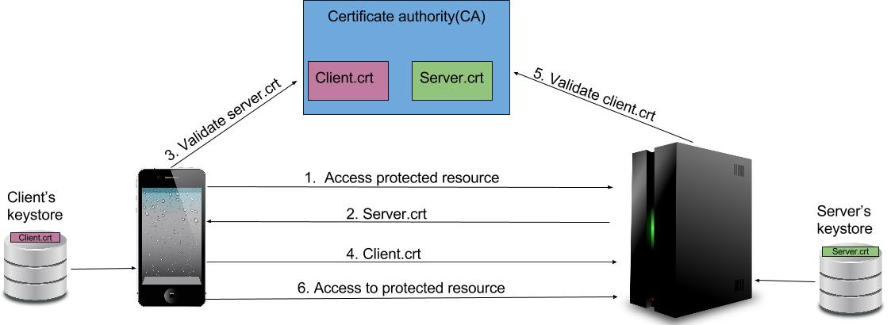

# Enabling Mutual SSL

### How it works

In contrast to the usual one-way SSL authentication where a client
verifies the identity of the server, in mutual SSL the server validates
the identity of the client so that both parties trust each other. This
builds a system that has a very tight security and avoids any requests
made to the client to provide the username/password, as long as the
server is aware of the certificates that belong to the client.

Before the process begins the client and servers certificates are stored
in there relevant `          keystores         ` . In the case of JAVA
they are `          jks         ` files. Let's take a look at where the
JKS files are saved:

-   WSO2 Identity Server certificates are stored in the
    `           <IS-HOME>/repository/resources/security/wso2carbon.jks          ` file.
-   Server side certificates are stored in the
    `           <IS-HOME>/repository/resources/security/clienttruststore.jks          ` file.

These certificates are signed and issued by a certificate authority that
allows both the client and server to communicate freely. Now let's look
at how it works:

 

1.  The Client attempts to access a protected resource and the SSL/TSL
    handshake process begins.
2.  The Server presents its certificate, which is the
    `           server.crt          ` according to our example as shown
    above.
3.  The Client takes this certificate and asks the certificate issued
    authority for the authenticity and validity of the certificate.
4.  If the certificate is valid, the client will also provide its
    certificate to the server.
5.  The Server takes this certificate and asks the certificate issued
    authority for the authenticity and validity of the certificate.
6.  The Client is granted access to the resource it was trying to access
    earlier.

### Enabling Mutual SSL in the WSO2 IS

1.  Open the
    `           <IS_HOME>/repository/conf/tomcat/catalina-server.xml         `
    file and ensure that the `           certificateVerification          ` attribute
    in the `          SSLHostConfig         ` tag under `https` connector is set to 
    `           want          ` as shown below. This is done to
    disable the certificate authentication on certain occasions (like
    when working on mobile apps). This makes two-way SSL authentication
    optional.

    ``` java
    certificateVerification="want"
    ```
    If not add the following configuration to ` <IS_HOME>/repository/conf/deployment.toml       `
    
    ```toml
    [transport.https.sslHostConfig.certificate.properties]
    certificateVerification = "want"
    ```
    

2.  Open the
    `           deployment.toml          `
    file and add the following configuration to enable the
    Mutual SSL Authenticator.

    ``` toml
    [admin_console.authenticator.mutual_ssl_authenticator]
    enable = true
    
    [admin_console.authenticator.mutual_ssl_authenticator.config]
    WhiteList = ""
    ```

3.  For mutual SSL authentication, the public certificate of the WSO2
    Identity Server has to be imported to the truststore of the client
    and the public certificate of the client has to be imported to the
    client-truststore of Identity Server.

    !!! example "Sample commands"

        The following two commands are examples if you are using the
        keystore and client-truststore of the Identity Server itself for the
        client. This is executed from the
        `<IS_HOME>/repository/resources/security`
        directory.

        ``` java
        keytool -export -alias wso2carbon -file carbon_public2.crt -keystore wso2carbon.jks -storepass wso2carbon
        ```

        ``` java
        keytool -import -trustcacerts -alias carbon -file carbon_public2.crt -keystore client-truststore.jks -storepass wso2carbon
        ```
