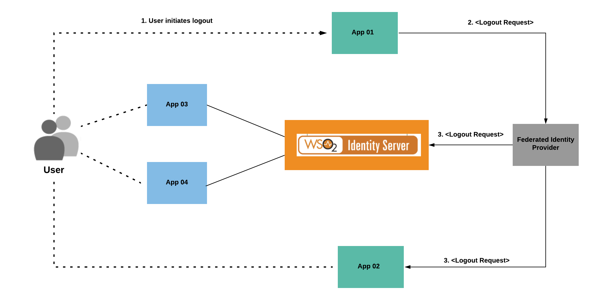

# Handling SAML Single Logout Requests from Federated Identity Providers

WSO2 Identity Server (WSO2 IS) supports handling SAML single logout requests from federated identity providers.
After the SAML single logout request is received by the federated identity provider, WSO2 IS processes the request, 
terminates the session, and then responds to the identity provider. This tutorial allows you to have
hands-on experience on handling SAML single logout requests from the federated identity provider. 

## Scenario

The diagram below shows a scenario where WSO2 Identity Server, App 01, and App 02 are service providers of the federated
identity provider (IdP). App 03 and App 04 are service providers of WSO2 Identity Server. When a user attempts to log out 
from App 01, the service provider sends a logout request to the federated IdP. The IdP determines the session participants using
the session index available in the logout request. Since WSO2 IS is a session participant, it receives a logout request
from the federated IdP. WSO2 IS handles this request, terminates the session and responds with a valid logout response.

        
## Trying out the flow with WSO2 Identity Server

To demonstrate this scenario, this tutorial uses two WSO2 IS servers which are running on port 443 (Primary IS) and 9444
(Secondary IS), and two sample web applications called "Pickup Dispatch" and "Pickup Manager". In this case, the 
Secondary IS acts as the external federated identity provider shown in the diagram below. The "Pickup Manager" acts as 
App 03 and 04, and "Pickup Dispatch" acts as App 01 and 02.

The following sections guide you through configuring SAML single logout requests handling and trying it out with 
the sample applications.

-   Configuring Identity Provider(Secondary IS) in the Primary IS
-   Configuring Pickup Dispatch application in the Primary IS
-   Configuring Primary IS(Service Provider) in the Secondary IS
-   Configuring Pickup Manager application in the Secondary IS

### Configuring Identity Provider(Secondary IS) in the Primary IS

1. Run the WSO2 Identity Server on port 9443 (Primary IS).

2. Log in to the management console as an administrator using the admin/admin credentials.

3. Navigate to **Main** to access the **Identity** menu. 

4. Click **Add** under **Identity Providers**. 

4. Fill in the details in the **Basic Information** section. Give a suitable name for the Identity Provider.

5. Expand the **SAML2 Web SSO Configuration** section and fill the required details. 
   
   
6. After providing the values for the required fields, click **Register**.

### Configuring Pickup Dispatch application in the Primary IS

The next step is to configure the Pickup Dispatch application as a service provider in the Primary IS.

1. Follow the steps in
   [deploying **saml2-web-app-pickup-dispatch** webapp](../../learn/deploying-the-sample-app/#deploying-the-saml2-web-app-pickup-dispatch-webapp)
   to download, deploy and register **dispatch** sample.
    
2. Once you have added the saml2 service provider, go to the **Service Provider Configuration** and expand **Local & Outbound Authentication Configuration**. 
        
3. Expand **SAML2 Web SSO Configuration** and click on **Configure**. Enable federated authentication and select **Secondary IS** as the authenticator.
 
 
 
### Configuring Primary IS(Service Provider) in the Secondary IS
 
The next step is to configure the Primary IS as a service provider in the Secondary IS.
 
1. Run the WSO2 Identity Server on port 9444 (Secondary IS).

2. Log in to the management console of the Secondary IS.

3. Follow the steps in [Configuring Pickup Dispatch application in the Primary IS](configuring-pickup-dispatch-application-in-the-primary-is) and configure the service provider with the details given below.

    - Issuer : SP Entity Id of the Secondary IS
    - Assertion Consumer URL : URL of the endpoint which receives SAML responses from the identity provider
    - Enable Single Logout (https://localhost:9443/commonauth)
    - SLO Request URL ; "http:/localhost:8080/identity/saml/slo" 

    !!! info "Note"
        Providing the SLO Request URL is a must. WSO2 IS receives the SAML single logout requests from this URL. For now, only front channel bindings are supported with this feature. For logout method, select one of the front channel bindings.
    
    

4. Leave the rest of the default configurations as it is and click **Register**. 

    
 
 
### Configuring Pickup Manager application in the Secondary IS

The next step is to configure the Pickup Manager application as a service provider in the Secondary IS.
 
Follow the steps in [deploying **saml2-web-app-pickup-manager** webapp](../../learn/deploying-the-sample-app/#deploying-the-saml2-web-app-pickup-manager-webapp) to download, deploy and register **manager** sample.
  
## Try it out!

Once you have completed configuring WSO2 IS as instructed in the above sections, try out the flow by running the 
sample applications.

1. Access the following URL on a browser window: http://localhost.com:8080/saml2-web-app-pickup-dispatch.com

2. Click **Login**. You will be redirected to the WSO2 Identity Server login page (federated IdP - port 9444).

3. Log in using your WSO2 Identity Server credentials. You will be redirected to the Pickup Dispatch application home page.

4. Now access the following URL on another browser window to access the Pickup Manager application, which is registered 
in the federated identity provider: http://localhost.com:8080/saml2-web-app-pickup-manager.com

    You will be redirected to the WSO2 Identity Server login page (federated IdP - port 9444).

5. Log in using your WSO2 IS credentials. You will be redirected to the Pickup Manager application home page.
6. Log out of the Pickup Manager application. You will be redirected back to the login page of the application.

7. Now attempt to access the Pickup Dispatch application. You will be automatically logged out of this application as well.

This means that you have successfully configured SAML2 single logout.

