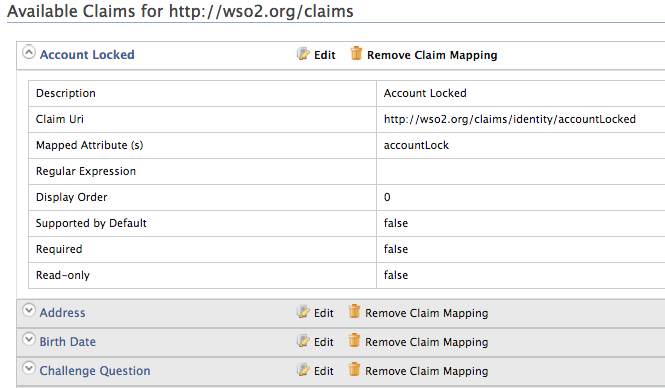
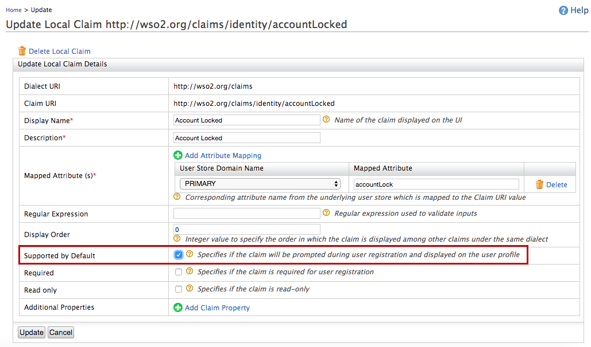

# Locking a Specific User Account

An administrative user can lock and unlock a particular user's account
through the management console or using the AdminService. Follow the
instructions given in the following sections to set this up.  

### Configure WSO2 IS for account locking

If you have not already configured WSO2 identity Server (WSO2 IS) for
account locking, expand the section below for instructions.

??? note "Click here for instructions"

    1.  Ensure that the identity listener with the
        `              priority=50             ` is set to **false** and
        the identity listener with the `              priority=95             ` is set to
        **true**  by adding the following configuration to the
        `              <IS_HOME>/repository/conf/deployment.toml             `
        file.  

        ``` xml
        [event.default_listener.identity_mgt]
        priority= "50"
        enable = false
        [event.default_listener.governance_identity_mgt]
        priority= "95"
        enable = true
        ```
         

    2.  <a name = "lockingaspecificuseraccount"></a>Start the Identity Server and log into the management console using
        your tenant credentials.
          
        !!! Tip
            Alternatively, you can also use the `   IdentityGovernanceAdminService     ` SOAP service to do this instead of using the management console UI. See [Calling Admin Services](../../develop/calling-admin-services)
            for more information on how to invoke this SOAP service. If you are using the SOAP service to configure this, you do not need to follow the steps given below this note.
            

      3.  Click **Resident** under **Identity Providers** found in the
         **Main** tab.
      4.  Expand the **Login Policies** tab.
    5.  Expand the **Account Locking** tab and select the **Account Lock
        Enabled** checkbox. Click **Update** to save changes.  
         

        !!! tip
            If a user is assigned the **Internal/system** role, the user can
            bypass account locking even if the user exceeds the specified number
            of **Maximum Failed Login Attempts**.
         
            !!! note
                  WSO2 Identity Server has the **Internal/system** role configured by
                  default. But generally a new user is not assigned the
                  **Internal/system** role by default. Required roles can be assigned
                  to a user depending on the set of permission a user needs to have.
                  For more information on roles and permission, see [Configuring Roles
                  and
                  Permissions](../../learn/configuring-roles-and-permissions)

                  Although the **Internal/system** role is configured by default in
                  WSO2 Identity Server, you can delete the role if necessary. To allow
                  users with the **Internal/system** role to bypass account locking,
                  you need to ensure that the role exists in WSO2 Identity Server.
               
              
      6.  To enable account locking for other tenants, log out and repeat the
         steps given above from [step 2](#lockingaspecificuseraccount)
         onwards.

!!! note 
    The user accounts that are assigned with the **Internal/system** user role cannot be locked.
    

### Enable claims for account locking

1.  Navigate to **Claims\>List** on the **Configure** menu and select
    the `http://wso2.org/claims` claim dialect.  
    For more information about claims, see [Claim Management](../../learn/claim-management).
2.  Select the Account Locked claim and click **Edit**.  
     
3.  Select the **Supported by Default** check box and click **Update**
.  
    This is done to make the "Account Locked" status appear in the
    user's profile.  
     

### Lock a specific user account

Once you have configured account locking as instructed above, you can
use one of the following methods to lock a user account.

#### Using the management console

An administrative user can lock a user account by editing the user’s
profile in the management console.

1.  Navigate to **Users and Roles\>List\>Users** on the **Main** menu
    and click on **User Profile** of the user you want to lock.
2.  If it is the first time this particular account is being locked, a
    text box will appear in front of the **Account Locked** field as
    seen below.  
    To lock the account, type true in the text box and click **Update**
.  
    

!!! note
    If it is not the first time you are locking this user account, there
    will be a check box instead of the text box (as shown above) in front of
    the **Account Locked** field. Select the check box to lock the account
    or deselect it to unlock the account and click **Update**.
    

#### Using the AdminService

An administrative user (with the permission level
/permission/admin/configure/security/usermgt/users ) can lock a user
account using the `         RemoteUserStoreManagerService        `. You
can use the `         setUserClaimValues        ` operation to achieve
this. The following request is a sample SOAP request that can be sent to
the `         RemoteUserStoreManagerService        ` to lock a user
account.

**Lock Account SOAP Request**

``` xml
<soapenv:Envelope xmlns:soapenv="http://schemas.xmlsoap.org/soap/envelope/" xmlns:ser="http://service.ws.um.carbon.wso2.org" xmlns:xsd="http://common.mgt.user.carbon.wso2.org/xsd">
   <soapenv:Header/>
   <soapenv:Body>
      <ser:setUserClaimValues>
         <!--Optional:-->
         <ser:userName>test</ser:userName>
         <!--Zero or more repetitions:-->
         <ser:claims>
            <!--Optional:-->
            <xsd:claimURI>http://wso2.org/claims/identity/accountLocked</xsd:claimURI>
            <!--Optional:-->
            <xsd:value>true</xsd:value>
         </ser:claims>
         <!--Optional:-->
         <ser:profileName>default</ser:profileName>
      </ser:setUserClaimValues>
   </soapenv:Body>
</soapenv:Envelope>
```

#### Unlocking a user account using the admin service

Similarly, you can use the `         setUserClaimValues        `
operation `         RemoteUserStoreManagerService        ` AdminService
to unlock a locked user account. The following request is a sample SOAP
request that can be sent to the
`         RemoteUserStoreManagerService        ` to unlock a user
account.

**Unlock Account SOAP Request**

``` xml
<soapenv:Envelope xmlns:soapenv="http://schemas.xmlsoap.org/soap/envelope/" xmlns:ser="http://service.ws.um.carbon.wso2.org" xmlns:xsd="http://common.mgt.user.carbon.wso2.org/xsd">
   <soapenv:Header/>
   <soapenv:Body>
      <ser:setUserClaimValues>
         <!--Optional:-->
         <ser:userName>test</ser:userName>
         <!--Zero or more repetitions:-->
         <ser:claims>
            <!--Optional:-->
            <xsd:claimURI>http://wso2.org/claims/identity/accountLocked</xsd:claimURI>
            <!--Optional:-->
            <xsd:value>false</xsd:value>
         </ser:claims>
         <!--Optional:-->
         <ser:profileName>default</ser:profileName>
      </ser:setUserClaimValues>
   </soapenv:Body>
</soapenv:Envelope>
```

### Configure email notifications for account locking

Once you have configured WSO2 Identity Server for user account locking,
you can also configure the WSO2 IS to email to the user's email address
when the user account is locked. To configure this, follow the steps
below.

1.  Enable the email sending configurations of the WSO2 Identity Server
    as explained [here](../../setup/configuring-email-sending).

2.  Restart the server.

    !!! tip
        The email template used to send the email notification for
        account locking is the **AccountLock** template and the template
        used for account disabling is the **AccountDisable** template. You
        can edit and customize the email template. For more information on
        how to do this, see [Customizing Automated
        Emails](../../learn/customizing-automated-emails).
  
WSO2 Identity Server uses separate email templates for notifying: 

- Account locking by administrator
- Account unlocking by administrator 

Add the following email templates by referring to the instructions in [Customizing Automated Emails](../../learn/customizing-automated-emails).

Following are the sample email templates.

??? example "Account lock by administrator"
    
    - Email Template Type: AccountLockAdmin
    - Template Language: English(United States)
    - Email Content Type:text/html
    - Subject : WSO2 - Your Account has been Locked
    - Email Body: 
    ```  
    <![CDATA[<table align="center" cellpadding="0" cellspacing="0" border="0" width="100%"bgcolor="#f0f0f0">
       <tr>
       <td style="padding: 30px 30px 20px 30px;">
           <table cellpadding="0" cellspacing="0" border="0" width="100%" bgcolor="#ffffff" style="max-width: 650px; margin: auto;">
           <tr>
               <td colspan="2" align="center" style="background-color: #333; padding: 40px;">
                   <a href="http://wso2.com/" target="_blank"></a>
               </td>
           </tr>
           <tr>
               <td colspan="2" align="center" style="padding: 50px 50px 0px 50px;">
                   <h1 style="padding-right: 0em; margin: 0; line-height: 40px; font-weight:300; font-family: 'Nunito Sans', Arial, Verdana, Helvetica, sans-serif; color: #666; text-align: left; padding-bottom: 1em;">
                       Account Locked
                   </h1>
               </td>
           </tr>
           <tr>
               <td style="text-align: left; padding: 0px 50px;" valign="top">
                   <p style="font-size: 18px; margin: 0; line-height: 24px; font-family: 'Nunito Sans', Arial, Verdana, Helvetica, sans-serif; color: #666; text-align: left; padding-bottom: 3%;">
                       Hi {{user.claim.givenname}},
                   </p>
                   <p style="font-size: 18px; margin: 0; line-height: 24px; font-family: 'Nunito Sans', Arial, Verdana, Helvetica, sans-serif; color: #666; text-align: left; padding-bottom: 3%;">
                       Please note that the account registered with the user name <b>{{user-name}}</b> has been locked. Please Contact the Administrator.<br>
                   </p>
               </td>
           </tr>
           <tr>
               <td style="text-align: left; padding: 30px 50px 50px 50px" valign="top">
                   <p style="font-size: 18px; margin: 0; line-height: 24px; font-family: 'Nunito Sans', Arial, Verdana, Helvetica, sans-serif; color: #505050; text-align: left;">
                       Thanks,<br/>WSO2 Identity Server Team
                   </p>
               </td>
           </tr>
           <tr>
               <td colspan="2" align="center" style="padding: 20px 40px 40px 40px;" bgcolor="#f0f0f0">
                   <p style="font-size: 12px; margin: 0; line-height: 24px; font-family: 'Nunito Sans', Arial, Verdana, Helvetica, sans-serif; color: #777;">
                       &copy; 2018
                       <a href="http://wso2.com/" target="_blank" style="color: #777; text-decoration: none">WSO2</a>
                       <br>
                       787 Castro Street, Mountain View, CA 94041.
                   </p>
               </td>
           </tr>
           </table>
       </td>
       </tr>
       </table>]]>
    ```
    - Footer : ---

??? example "Account unlock by administrator"

    - Email Template Type: AccountUnlockAdmin
    - Template Language: English(United States)
    - Email Content Type:text/html
    - Subject : WSO2 - Your Account has been Unlocked
    - Email Body: 
    ```  
    <![CDATA[<table align="center" cellpadding="0" cellspacing="0" border="0" width="100%"bgcolor="#f0f0f0">
       <tr>
       <td style="padding: 30px 30px 20px 30px;">
           <table cellpadding="0" cellspacing="0" border="0" width="100%" bgcolor="#ffffff" style="max-width: 650px; margin: auto;">
           <tr>
               <td colspan="2" align="center" style="background-color: #333; padding: 40px;">
                   <a href="http://wso2.com/" target="_blank"></a>
               </td>
           </tr>
           <tr>
               <td colspan="2" align="center" style="padding: 50px 50px 0px 50px;">
                   <h1 style="padding-right: 0em; margin: 0; line-height: 40px; font-weight:300; font-family: 'Nunito Sans', Arial, Verdana, Helvetica, sans-serif; color: #666; text-align: left; padding-bottom: 1em;">
                       Account Unlocked
                   </h1>
               </td>
           </tr>
           <tr>
               <td style="text-align: left; padding: 0px 50px;" valign="top">
                   <p style="font-size: 18px; margin: 0; line-height: 24px; font-family: 'Nunito Sans', Arial, Verdana, Helvetica, sans-serif; color: #666; text-align: left; padding-bottom: 3%;">
                       Hi {{user.claim.givenname}},
                   </p>
                   <p style="font-size: 18px; margin: 0; line-height: 24px; font-family: 'Nunito Sans', Arial, Verdana, Helvetica, sans-serif; color: #666; text-align: left; padding-bottom: 3%;">
                       Please note that the account registered with the user name <b>{{user-name}}</b> has been unlocked by administrator. <br>
                   </p>
               </td>
           </tr>
           <tr>
               <td style="text-align: left; padding: 30px 50px 50px 50px" valign="top">
                   <p style="font-size: 18px; margin: 0; line-height: 24px; font-family: 'Nunito Sans', Arial, Verdana, Helvetica, sans-serif; color: #505050; text-align: left;">
                       Thanks,<br/>WSO2 Identity Server Team
                   </p>
               </td>
           </tr>
           <tr>
               <td colspan="2" align="center" style="padding: 20px 40px 40px 40px;" bgcolor="#f0f0f0">
                   <p style="font-size: 12px; margin: 0; line-height: 24px; font-family: 'Nunito Sans', Arial, Verdana, Helvetica, sans-serif; color: #777;">
                       &copy; 2018
                       <a href="http://wso2.com/" target="_blank" style="color: #777; text-decoration: none">WSO2</a>
                       <br>
                       787 Castro Street, Mountain View, CA 94041.
                   </p>
               </td>
           </tr>
           </table>
       </td>
       </tr>
       </table>]]>
    <![CDATA[<table align="center" cellpadding="0" cellspacing="0" border="0" width="100%"bgcolor="#f0f0f0">
       <tr>
       <td style="padding: 30px 30px 20px 30px;">
           <table cellpadding="0" cellspacing="0" border="0" width="100%" bgcolor="#ffffff" style="max-width: 650px; margin: auto;">
           <tr>
               <td colspan="2" align="center" style="background-color: #333; padding: 40px;">
                   <a href="http://wso2.com/" target="_blank"></a>
               </td>
           </tr>
           <tr>
               <td colspan="2" align="center" style="padding: 50px 50px 0px 50px;">
                   <h1 style="padding-right: 0em; margin: 0; line-height: 40px; font-weight:300; font-family: 'Nunito Sans', Arial, Verdana, Helvetica, sans-serif; color: #666; text-align: left; padding-bottom: 1em;">
                       Account Unlocked
                   </h1>
               </td>
           </tr>
           <tr>
               <td style="text-align: left; padding: 0px 50px;" valign="top">
                   <p style="font-size: 18px; margin: 0; line-height: 24px; font-family: 'Nunito Sans', Arial, Verdana, Helvetica, sans-serif; color: #666; text-align: left; padding-bottom: 3%;">
                       Hi {{user.claim.givenname}},
                   </p>
                   <p style="font-size: 18px; margin: 0; line-height: 24px; font-family: 'Nunito Sans', Arial, Verdana, Helvetica, sans-serif; color: #666; text-align: left; padding-bottom: 3%;">
                       Please note that the account registered with the user name <b>{{user-name}}</b> has been unlocked by administrator. <br>
                   </p>
               </td>
           </tr>
           <tr>
               <td style="text-align: left; padding: 30px 50px 50px 50px" valign="top">
                   <p style="font-size: 18px; margin: 0; line-height: 24px; font-family: 'Nunito Sans', Arial, Verdana, Helvetica, sans-serif; color: #505050; text-align: left;">
                       Thanks,<br/>WSO2 Identity Server Team
                   </p>
               </td>
           </tr>
           <tr>
               <td colspan="2" align="center" style="padding: 20px 40px 40px 40px;" bgcolor="#f0f0f0">
                   <p style="font-size: 12px; margin: 0; line-height: 24px; font-family: 'Nunito Sans', Arial, Verdana, Helvetica, sans-serif; color: #777;">
                       &copy; 2018
                       <a href="http://wso2.com/" target="_blank" style="color: #777; text-decoration: none">WSO2</a>
                       <br>
                       787 Castro Street, Mountain View, CA 94041.
                   </p>
               </td>
           </tr>
           </table>
       </td>
       </tr>
       </table>]]>
    ```
    - Footer : ---
