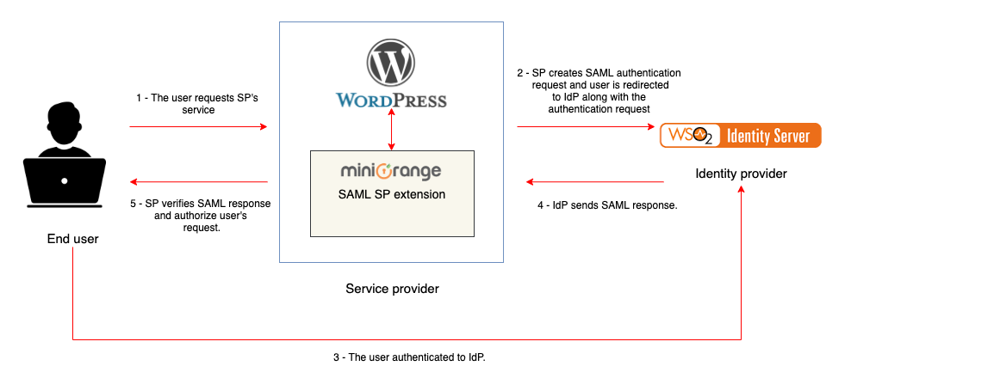
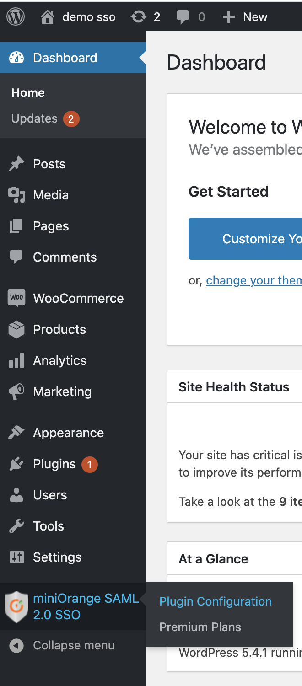
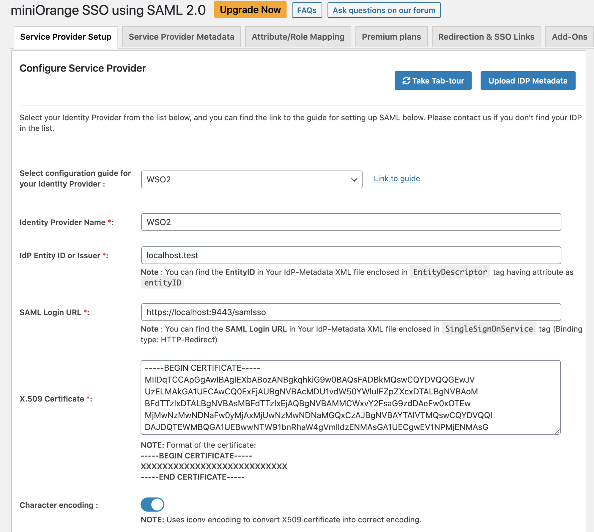
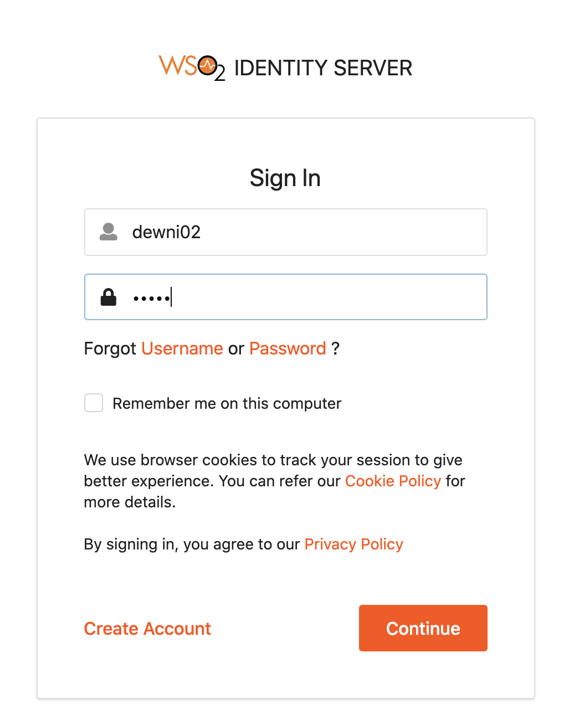
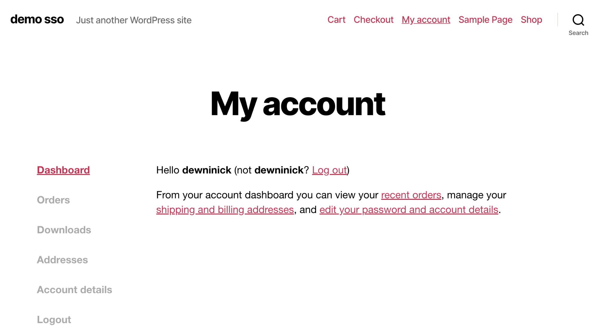

# Logging in to WordPress using the Identity Server

WordPress is a popular open-source content management system. This topic provides instructions on configuring WordPress 
and WSO2 Identity Server (WSO2 IS) to enable users to log in to WordPress using your WSO2 IS credentials.

In this tutorial, WSO2 Identity Server acts as the identity provider and the miniOrange SAML Single Sign on (SSO) third 
party plugin acts as the SAML 2.0 service provider which can be configured to establish the trust between the plugin 
and WSO2 IS to securely authenticate the user to the WordPress site.

## The flow

The diagram below demonstrates the flow of how WordPress uses WSO2 Identity Server as a SAML2 federated authenticator to 
authenticate a user.



!!! tip "Before you begin!"
    You need to have WordPress installed. Refer: [https://wordpress.org/support/article/how-to-install-wordpress/](https://wordpress.org/support/article/how-to-install-wordpress/)
 
Let's get started!

## Configure SAML SSO extension in WordPress

1.  In the WordPress admin dashboard, on the left navigation panel click **Plugins > Add New**.

2.  Install miniOrange SSO using SAML 2.0 extension.
    

3.  On the left navigation panel, click **miniOrange SAML 2.0 SSO > Plugin Configuration**.
    

4.  Navigate to **Service Provider Metadata** tab. Here you will see the configuration details which will be needed 
later for Identity Provider configurations.
    
    
5.  In the **Service Provider Setup** tab, click **Upload IDP Metadata** and enter the following values.
    1. Identity Provider Name: WSO2
    2. Enter metadata URL: https://localhost:9443/identity/metadata/saml2
    
    !!! Note 
        Browse ```<IS_HOME>/repository/resources/conf/templates/repository/conf/identity/identity.xml.j2``` file and 
        add the following configuration as a sub tag of `ResourceAccessControl` tag.
         
        &nbsp;```<Resource context="(.*)/identity/metadata/(.*)" secured="false" http-method="all"/>```
        
6.  Click on **Fetch Metadata**.

    
    
    Given below is the fetched IdP metadata information.
    
    
    
7.  To add the SSO widget to WordPress site, login as admin and click on **Customize** from the menu in the top left 
corner.

8.  Select **Widgets** and add the SSO widget to any preferred location of the site.
    
    
9.  Publish the changes.

## Configuring the service provider in WSO2 Identity Server

1.  Sign in to the WSO2 Identity Server [Management Console](../../setup/getting-started-with-the-management-console/).

2.  On the **Main** menu, click **Identity > Service Providers > Add**.

3.  Fill in the **Service Provider Name** and provide a brief **Description** of the service provider. Only 
Service Provider Name is a required field and you can use WordPress-SP as the name for this example.

4.  Expand **Claim Configuration**.
    1. Select **Use Local Claim Dialect**.
    2. For **Requested Claims**, add ```https://wso2.org/claims/emailaddress``` claim URI.
    3. Set **Subject Claim URI** to ```https://wso2.org/claims/nickname```.

    

5.  Expand the **Inbound Authentication Configuration > SAML2 Web SSO Configuration** section and click **Configure**.
    In the form that appears, fill out the following configuration details required for single sign-on. 
    For more details on these attributes, refer 
    [SAML2 Web SSO Configuration](../../learn/configuring-inbound-authentication-for-a-service-provider#configuring-inbound-authentication-with-saml2-web-sso).
    1. For the value of **Issuer**, provide the SP Entity ID obtained as Service Provider Metadata when configuring 
    SAML SSO extension in WordPress.
    2. For the value of **Assertion Consumer URL**, provide the ACS Url obtained as Service Provider Metadata when 
    configuring SAML SSO extension in WordPress. 
    3. Uncheck **Enable Signature Validation in Authentication Requests and Logout Requests**.
    4. Check **Enable Attribute Profile** and **Include Attributes in the Response Always**.
    5. Check **Enable Audience Restriction**. Enter the Audience URL obtained as Service Provider Metadata when 
    configuring SAML SSO extension in WordPress and click **Add Audience**.
    6. Check **Enable Recipient Validation**. Enter the Recipient URL obtained as Service Provider Metadata when 
    configuring SAML SSO extension in WordPress and click **Add Recipient**. 
    7. Save the configuration.
    
    

## Try it out

1.  Visit the WordPress site and click on the SSO widget.
    

2.  You will be redirected to WSO2 Identity Server login page. Login by providing credentials of a user in WSO2 IS.
    

3.  Upon successful login you will be logged in to WordPress.
    
    