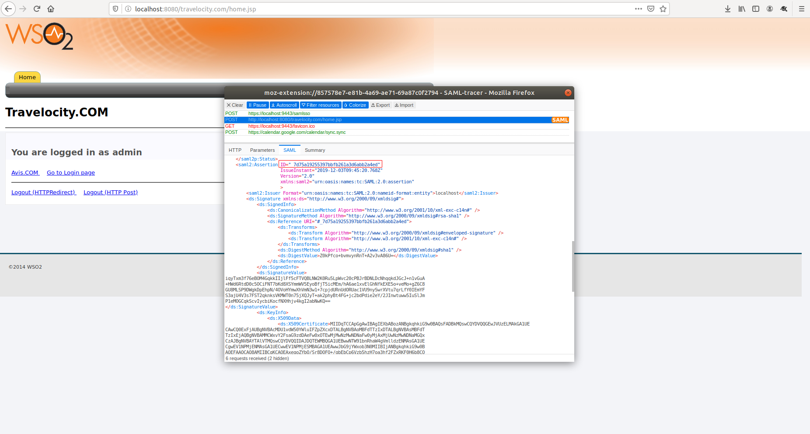
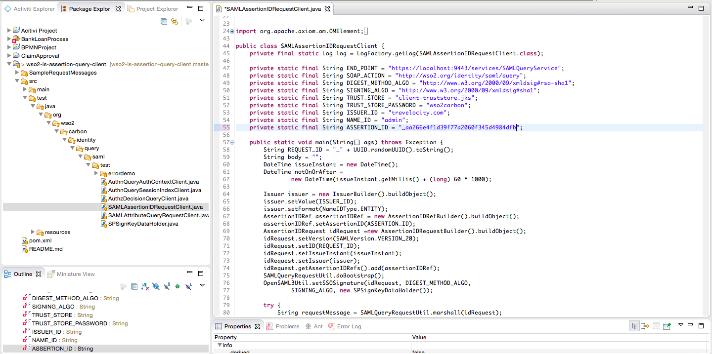

# Querying SAML Assertions

## About SAML assertions

The SAML Assertion Query/Request profile enables service providers to query dynamic or existing assertions using standard request messages via WSO2 Identity Server. According to the [specification](https://docs.oasis-open.org/security/saml/v2.0/saml-profiles-2.0-os.pdf) the following
two entities are used for this interaction:

-   **SAML Requester**: This entity issues the SAML query/request message.
-   **SAML Authority**: This entity returns the SAML2 Assertion based on the request/query.  

The Assertion Query/Request Profile defines five major request/query message types that can be used to request assertions from SAML authority.

-   **AssertionIDRequest**: This is used to request an assertion when given its unique ID.  
-   **SubjectQuery**:  This is used to query the assertion by presenting a subject to the SAML authority and assembling response messages.
-   **AuthnQuery**: This is used to request existing assertions about an existing subject. It is inherited from the `SubjectQuery` message type.
-   **AttributeQuery**: This is used to request attributes about an existing subject. It is inherited from the `SubjectQuery` message type.
-   **AuthzDecisionQuery**: This is used to request an authorization decision based on an existing subject.
 

## Try out 

Let's learn how to query SAML assertions using WSO2 Identity Server!

!!! tip "Before you begin" 

    1.  Download the client application zip file named "saml-query-profile-client.zip" from [this GitHub location](https://github.com/wso2/samples-is/tree/master/saml-query-profile-target) extract and open it using an IDE. Hereafter, the root directory of the extracted zip will be referred to as `<CLIENT_HOME>` in this document.

    2.  To build the client application, navigate to the `<CLIENT_HOME>` directory in a command prompt and execute the following command.

        ``` java
        mvn clean install
        ```

    3.  Install a SAML Tracer (plugin/application) that enables searching assertions.

    !!! note
            If you are using a product version of **5.9.0 or below** then, you should replace the `wso2carbon.jks` keystore
            located at `<CLIENT_HOME>/src/main/resources/` with the `wso2carbon.jks` keystore located at `<PRODUCT_HOME>/repository/resources/security`.

### With the sample

Follow the steps below to query assertions with `AssertionID` using a WSO2 Identity Server sample application.

1.  [Set up the Travelocity sample application](../../learn/deploying-the-sample-app/#deploying-the-travelocity-webapp).

2.  [Configure the Travelocity sample application as a service provider](../../learn/deploying-the-sample-app/#configuring-the-service-provider).  

    1.  In the **Inbound Authentication Configuration** section, click **SAML2 Web SSO Configuration > Configure**.
        
    
    2.  Configure the required fields.

        !!! note

            Make sure to select the **Enable Assertion Query Request Profile** check box. 
    
        
        
    3.  Click **Update**.

    You have now successfully added and configured the service provider. 

3.  To use a custom assertion builder with the capability to persist assertions to the database for this profile.

    1.  Open the `deployment.toml` file in the `<IS_HOME>/repository/conf` directory.

    2.  Add the following configuration. 

        ``` toml
        [saml.extensions] 
        assertion_builder= "org.wso2.carbon.identity.sso.saml.builders.assertion.ExtendedDefaultAssertionBuilder"
        ```

4.  Restart WSO2 Identity Server.

5.  Access the Travelocity application via `http://wso2is.local:8080/travelocity.com/index.jsp`.

6.  Start the SAML Tracer.

7.  Log in as an administrator (credentials: `admin`/`admin`).

    !!! note 
        When a user logs in, the created assertion will be persisted in the SAML Tracer.

8. To query the assertions:

    1.  Copy the attribute **ID** value that is located inside the tag `<saml2:Assertion>` of the created assertion. You may use this Id to query the assertion using an `AssertionIDRequest`.

    

    2. Navigate to `<CLIENT_HOME>/src/main/java/org/wso2/carbon/identity/saml/query/profile/test` directory.

    3. Open the `SAMLAssertionIDRequestClient.java` class and assign the `AssertionID` that you copied from the assertion to the `ASSERTION_ID` variable.

    

    4. Run the `main()` method of the class. Note that a request and response get generated similar to the following.

    ??? note "AssertionIDRequest Request"
        ```xml
            <?xml version="1.0" encoding="UTF-8" ?>
            <saml2p:AssertionIDRequest xmlns:saml2p="urn:oasis:names:tc:SAML:2.0:protocol" ID="_1c785f98-4e41-4a4d-a496-5e7432e700fa" IssueInstant="2016-09-12T03:18:24.762Z" Version="2.0">
                <saml2:Issuer xmlns:saml2="urn:oasis:names:tc:SAML:2.0:assertion" Format="urn:oasis:names:tc:SAML:2.0:nameid-format:entity">travelocity.com</saml2:Issuer>
                <ds:Signature xmlns:ds="http://www.w3.org/2000/09/xmldsig#">
                    <ds:SignedInfo>
                        <ds:CanonicalizationMethod Algorithm="http://www.w3.org/2001/10/xml-exc-c14n#" />
                        <ds:SignatureMethod Algorithm="http://www.w3.org/2000/09/xmldsig#rsa-sha1" />
                        <ds:Reference URI="#_1c785f98-4e41-4a4d-a496-5e7432e700fa">
                            <ds:Transforms>
                                <ds:Transform Algorithm="http://www.w3.org/2000/09/xmldsig#enveloped-signature" />
                                <ds:Transform Algorithm="http://www.w3.org/2001/10/xml-exc-c14n#" />
                            </ds:Transforms>
                            <ds:DigestMethod Algorithm="http://www.w3.org/2000/09/xmldsig#sha1" />
                            <ds:DigestValue>TFH3NQVv2N41PnPh3G2dKDgg0mw=</ds:DigestValue>
                        </ds:Reference>
                    </ds:SignedInfo>
                    <ds:SignatureValue>a1wabcJTMDUv0KYTU3ftukKDR7e2zgd9Q6OFMDJmee7HcKb896spUprQIjMuvoMie9fxnm2+7346 q/zi5fe5Vdjid9MMAN7ls4iNbrIYnlHTdJzYX7ulQpNQ76GJevZw4N65qf/oaamc4HOOFw3TZYtv jYX0osmGqW5MjR9b748lQJ4kKgtgxzvT92s8Yn9OndJ+970pRuPdgZO57/LueSvUjHLfA7AuGGbH 5WDYuK4BJ6WnrhqzJ2Zc/OpilOO3uoP/RW4kJEtbMFpH6xWnb552uRYdS121qJasZM9aqzfKa0NH sWrZpmqwz0inXmZliqFShuhRKkIOF+2CmdZgXg==
                    </ds:SignatureValue>
                    <ds:KeyInfo>
                        <ds:X509Data>
                            <ds:X509Certificate>MIIDezCCAmOgAwIBAgIEa4wPCDANBgkqhkiG9w0BAQsFADBuMQswCQYDVQQGEwJMSzEQMA4GA1UE CBMHd2VzdGVybjEQMA4GA1UEBxMHY29sb21ibzEUMBIGA1UEChMLc29hc2VjdXJpdHkxETAPBgNV BAsTCHNlY3VyaXR5MRIwEAYDVQQDEwlsb2NhbGhvc3QwHhcNMTYwNzEzMTczMDQ5WhcNMTYxMDEx MTczMDQ5WjBuMQswCQYDVQQGEwJMSzEQMA4GA1UECBMHd2VzdGVybjEQMA4GA1UEBxMHY29sb21i bzEUMBIGA1UEChMLc29hc2VjdXJpdHkxETAPBgNVBAsTCHNlY3VyaXR5MRIwEAYDVQQDEwlsb2Nh bGhvc3QwggEiMA0GCSqGSIb3DQEBAQUAA4IBDwAwggEKAoIBAQCRo50ubPqW09rzptxmKIaeSjFP UbkmsMUn1jQvrH5vyumRjBKDY//uXQwcCAcmTw4Bb5RVdZVOiJPxQixQghBGgaVv3UobuilYtNuS /qEVZvnX4RBNkADOXXp+inf5a8OQYjVV7aac1bcSFx/4DgvcWT6mPLpm4dMVMhBWYye0gfPHKMIR 1W1BR/+dJuZePJVa0xFzJ33CBA38vrqg6OuEsZY0fMMfFasyxepUlIECTkKq7ie5PP+31gqw9cAu bIfeO9HtXcQBC7GPgcCgRV7+azJS1MgxbpvlDHJnVxcTcX3IdMCrclCC87DJIMVpbDeK6oGSqbhu Kn69sqnq6e9PAgMBAAGjITAfMB0GA1UdDgQWBBRRWwyTdsm/QxyObtcHBKtH0EMQ2zANBgkqhkiG 9w0BAQsFAAOCAQEANy3xYK8wD9EuKyXbAeEJs5jvoL/2cI4EOZfP1VKAa3SHv+AYPzxqmuyMpD2f 6Tx9yyOP+0QNNynHMC6RPjz8Ib5GzSbvUfbJKXAU7GPc/7riKMJzv52NI8KqFdQ1Y7YiKAMs5dpJ QAhiLlRU9yuhljWqXQ5h8eVJ+vO+9+VPSctDuNpHrhbIZbwAd5Cf+Avp7VDdaU2UIG3Xg7AJkXRF Oa0pEVPW+brkq9uLYTA4bMcr+ROH9REUA0f1AuWfi4aVDFptfVwULCqT9PPliqoZxJEzqccGjWgf Q0NktrBaTVRQo5BPpfRja5l7ajYAPKL7vS3OGCF1Ycocq6Wa6WMj7g==
                            </ds:X509Certificate>
                        </ds:X509Data>
                    </ds:KeyInfo>
                </ds:Signature>
                <saml2:AssertionIDRef xmlns:saml2="urn:oasis:names:tc:SAML:2.0:assertion">_f013b1db55d7bdea33102b4d72159011</saml2:AssertionIDRef>
            </saml2p:AssertionIDRequest>
        ```

    ??? note "AssertionIDRequest Response"
        ```xml
            <?xml version="1.0" encoding="UTF-8" ?>
            <saml2p:Response xmlns:saml2p="urn:oasis:names:tc:SAML:2.0:protocol" ID="_714cddb7f1c42d64376f0e6bd9d2f310" IssueInstant="2016-09-12T03:18:31.233Z" Version="2.0">
                <saml2:Issuer xmlns:saml2="urn:oasis:names:tc:SAML:2.0:assertion" Format="urn:oasis:names:tc:SAML:2.0:nameid-format:entity">localhost</saml2:Issuer>
                <ds:Signature xmlns:ds="http://www.w3.org/2000/09/xmldsig#">
                    <ds:SignedInfo>
                        <ds:CanonicalizationMethod Algorithm="http://www.w3.org/2001/10/xml-exc-c14n#" />
                        <ds:SignatureMethod Algorithm="http://www.w3.org/2000/09/xmldsig#rsa-sha1" />
                        <ds:Reference URI="#_714cddb7f1c42d64376f0e6bd9d2f310">
                            <ds:Transforms>
                                <ds:Transform Algorithm="http://www.w3.org/2000/09/xmldsig#enveloped-signature" />
                                <ds:Transform Algorithm="http://www.w3.org/2001/10/xml-exc-c14n#" />
                            </ds:Transforms>
                            <ds:DigestMethod Algorithm="http://www.w3.org/2000/09/xmldsig#sha1" />
                            <ds:DigestValue>+ghoomfq6hsNvVqr3+SKcGowIu0=</ds:DigestValue>
                        </ds:Reference>
                    </ds:SignedInfo>
                    <ds:SignatureValue>YofQrnFqtF2bDrq7w1CsKQKI/E3GdimZ4INryN27hX4bSXa3EP4gHsGr0MH+Hhk6g9xYHbVBuCQR ht+/j8EBBmBnqHIxPrg43Xn+zNg9FmKtwqa8rXJeu5pELq0dhx/X6tSVzXAuDmLoOlyO/YwEYmuJ wnUZce4MfIlNt7UdyqM=
                    </ds:SignatureValue>
                    <ds:KeyInfo>
                        <ds:X509Data>
                            <ds:X509Certificate>MIICNTCCAZ6gAwIBAgIES343gjANBgkqhkiG9w0BAQUFADBVMQswCQYDVQQGEwJVUzELMAkGA1UE CAwCQ0ExFjAUBgNVBAcMDU1vdW50YWluIFZpZXcxDTALBgNVBAoMBFdTTzIxEjAQBgNVBAMMCWxv Y2FsaG9zdDAeFw0xMDAyMTkwNzAyMjZaFw0zNTAyMTMwNzAyMjZaMFUxCzAJBgNVBAYTAlVTMQsw CQYDVQQIDAJDQTEWMBQGA1UEBwwNTW91bnRhaW4gVmlldzENMAsGA1UECgwEV1NPMjESMBAGA1UE AwwJbG9jYWxob3N0MIGfMA0GCSqGSIb3DQEBAQUAA4GNADCBiQKBgQCUp/oV1vWc8/TkQSiAvTou sMzOM4asB2iltr2QKozni5aVFu818MpOLZIr8LMnTzWllJvvaA5RAAdpbECb+48FjbBe0hseUdN5 HpwvnH/DW8ZccGvk53I6Orq7hLCv1ZHtuOCokghz/ATrhyPq+QktMfXnRS4HrKGJTzxaCcU7OQID AQABoxIwEDAOBgNVHQ8BAf8EBAMCBPAwDQYJKoZIhvcNAQEFBQADgYEAW5wPR7cr1LAdq+IrR44i QlRG5ITCZXY9hI0PygLP2rHANh+PYfTmxbuOnykNGyhM6FjFLbW2uZHQTY1jMrPprjOrmyK5sjJR O4d1DeGHT/YnIjs9JogRKv4XHECwLtIVdAbIdWHEtVZJyMSktcyysFcvuhPQK8Qc/E/Wq8uHSCo=
                            </ds:X509Certificate>
                        </ds:X509Data>
                    </ds:KeyInfo>
                </ds:Signature>
                <saml2p:Status>
                    <saml2p:StatusCode Value="urn:oasis:names:tc:SAML:2.0:status:Success" />
                </saml2p:Status>
                <saml2:Assertion xmlns:saml2="urn:oasis:names:tc:SAML:2.0:assertion" ID="_f013b1db55d7bdea33102b4d72159011" IssueInstant="2016-09-11T10:51:06.563Z" Version="2.0">
                    <saml2:Issuer Format="urn:oasis:names:tc:SAML:2.0:nameid-format:entity">localhost</saml2:Issuer>
                    <ds:Signature xmlns:ds="http://www.w3.org/2000/09/xmldsig#">
                        <ds:SignedInfo>
                            <ds:CanonicalizationMethod Algorithm="http://www.w3.org/2001/10/xml-exc-c14n#" />
                            <ds:SignatureMethod Algorithm="http://www.w3.org/2000/09/xmldsig#rsa-sha1" />
                            <ds:Reference URI="#_f013b1db55d7bdea33102b4d72159011">
                                <ds:Transforms>
                                    <ds:Transform Algorithm="http://www.w3.org/2000/09/xmldsig#enveloped-signature" />
                                    <ds:Transform Algorithm="http://www.w3.org/2001/10/xml-exc-c14n#" />
                                </ds:Transforms>
                                <ds:DigestMethod Algorithm="http://www.w3.org/2000/09/xmldsig#sha1" />
                                <ds:DigestValue>4Ga5N4FTMUTAdkxiiuj9OeGTf3c=</ds:DigestValue>
                            </ds:Reference>
                        </ds:SignedInfo>
                        <ds:SignatureValue>LRh6u1wTb7h7NgY+UoWtlgxhXRFyceYGxI7Q+ava2r+MhXl/N/uL5PgW6Bad5UwhqivINGuSrYJd L++taWxyaOVFQPNp2nEMRn+BhMgR2lWpyU/aaXgDIPyZGG5MrF0VI3r1s1NNBc1n0tREOeqxTSFZ eDLW/J2xCRYIZm8HKSU=
                        </ds:SignatureValue>
                        <ds:KeyInfo>
                            <ds:X509Data>
                                <ds:X509Certificate>MIICNTCCAZ6gAwIBAgIES343gjANBgkqhkiG9w0BAQUFADBVMQswCQYDVQQGEwJVUzELMAkGA1UE CAwCQ0ExFjAUBgNVBAcMDU1vdW50YWluIFZpZXcxDTALBgNVBAoMBFdTTzIxEjAQBgNVBAMMCWxv Y2FsaG9zdDAeFw0xMDAyMTkwNzAyMjZaFw0zNTAyMTMwNzAyMjZaMFUxCzAJBgNVBAYTAlVTMQsw CQYDVQQIDAJDQTEWMBQGA1UEBwwNTW91bnRhaW4gVmlldzENMAsGA1UECgwEV1NPMjESMBAGA1UE AwwJbG9jYWxob3N0MIGfMA0GCSqGSIb3DQEBAQUAA4GNADCBiQKBgQCUp/oV1vWc8/TkQSiAvTou sMzOM4asB2iltr2QKozni5aVFu818MpOLZIr8LMnTzWllJvvaA5RAAdpbECb+48FjbBe0hseUdN5 HpwvnH/DW8ZccGvk53I6Orq7hLCv1ZHtuOCokghz/ATrhyPq+QktMfXnRS4HrKGJTzxaCcU7OQID AQABoxIwEDAOBgNVHQ8BAf8EBAMCBPAwDQYJKoZIhvcNAQEFBQADgYEAW5wPR7cr1LAdq+IrR44i QlRG5ITCZXY9hI0PygLP2rHANh+PYfTmxbuOnykNGyhM6FjFLbW2uZHQTY1jMrPprjOrmyK5sjJR O4d1DeGHT/YnIjs9JogRKv4XHECwLtIVdAbIdWHEtVZJyMSktcyysFcvuhPQK8Qc/E/Wq8uHSCo=
                                </ds:X509Certificate>
                            </ds:X509Data>
                        </ds:KeyInfo>
                    </ds:Signature>
                    <saml2:Subject>
                        <saml2:NameID Format="urn:oasis:names:tc:SAML:1.1:nameid-format:emailAddress">admin</saml2:NameID>
                        <saml2:SubjectConfirmation Method="urn:oasis:names:tc:SAML:2.0:cm:bearer">
                            <saml2:SubjectConfirmationData NotOnOrAfter="2016-09-11T10:56:06.467Z" Recipient="http://travelocity.com" />
                        </saml2:SubjectConfirmation>
                    </saml2:Subject>
                    <saml2:Conditions NotBefore="2016-09-11T10:51:06.563Z" NotOnOrAfter="2016-09-11T10:56:06.467Z">
                        <saml2:AudienceRestriction>
                            <saml2:Audience>travelocity.com</saml2:Audience>
                        </saml2:AudienceRestriction>
                    </saml2:Conditions>
                    <saml2:AuthnStatement AuthnInstant="2016-09-11T10:51:06.580Z" SessionIndex="d1e12225-6c86-49f7-9d13-b07793caecc4">
                        <saml2:AuthnContext>
                            <saml2:AuthnContextClassRef>urn:oasis:names:tc:SAML:2.0:ac:classes:Password</saml2:AuthnContextClassRef>
                        </saml2:AuthnContext>
                    </saml2:AuthnStatement>
                </saml2:Assertion>
            </saml2p:Response>
        ```

You have successfully queried an assertion with the `AssertionIDRequest` using the sample application. 
    

### With your application

Follow the steps below to query assertions using a custom application. 

1.  To configure the custom application as a service provider:

    1.  Access the WSO2 Identity Server Management Console as an administrator. 

    2.  On the **Main** menu, click **Identity > Service Providers > Add**.

    3.  Enter a name for the custom application in the **Service Provider Name** text box and click **Register**.

    4.  In the **Inbound Authentication Configuration** section, click **SAML2 Web SSO Configuration > Configure**.
        

    5.  Enter the required configurations.

    6.  Configure the required fields.

        !!! note

            Make sure to select the **Enable Assertion Query Request Profile** check box. 
    
        
        
    7.  Click **Update**.

2.  To use a custom assertion builder that enables persisting assertions in the database for this profile:

    1.  Open the `deployment.toml` file in the `<IS_HOME>/repository/conf` directory.

    2.  Add the following configurations.

        ``` toml
        [saml.extensions] 
        assertion_builder= "org.wso2.carbon.identity.sso.saml.builders.assertion.ExtendedDefaultAssertionBuilder"
        ```
    
3.  Access the application that you configured as a service provider via the assertion consumer URL that you configured in step 1.e above.

4.  Start the SAML Tracer.

5.  Log in as an administrator (credentials: `admin`/`admin`).

    !!! note 
        When a user logs in, the created assertion will be persisted in the SAML Tracer.

6.  To query the assertions:

    1.  Navigate to the `<CLIENT_HOME>/src/main/java/org/wso2/carbon/identity/saml/query/profile/test` directory.

    2.  Open the relevant java class of the query type you wish to request
        (e.g., `          SAMLAssertionIDRequestClient.java         ` ),
        enter the required values extracted from the assertion, and run the main() method of the
        class. An assertion request will be generated.

    3. Note that a request and response get generated according to the given query type.

    !!! tip 

        A sample for each request can be found at the `<CLIENT_HOME>/sample-request-messages` directory.

You have successfully queried an assertion using a custom application. 
