# User Portal

## Introduction

The new WSO2 Identity Server user portal is packed with a number of new
components through which users can manage their user account-related
preferences with more convenience. The latest set of features that will be
available with the new user portal includes:

- User profile management
- Linked accounts
- Export user profile
- Reset password
- Account recovery
- Multi-factor authentication
- Monitor active user sessions
- Consent management
- Review pending approvals

This section briefs you on what each of the above-mentioned features are. It will further guide you through how to use these features depending on your preferences and requirements.

## Accessing the user portal and its components

1. Go to the user portal URL: `https://(host name):(port name)/user-portal/`, for example, `<https://localhost:9443/user-portal>`.

2. Enter your username and password and click the **Sign In** button.

3. The user portal appears.  

!!! note "Display Name of the User Portal"
       In the user portal a welcome message will be displayed with the user's First Name, Last Name, Display Name 
       or the User Name. Now if the Display Name of the corresponding user is present in the user's profile details,
        that Display Name can be displayed in the user portal. To maintain the backward compatibility, this was introduced with a 
        configuration that can be used to enable this feature. 
        To enable the feature, add the following configuration to the `runtime-config.js` file located in 
        `<IS-HOME>/repository/deployment/server/webapps/user-portal/` directory.
        `useUserProfileDisplayName : true`
        The final view of the `runtime-config.js` file after applying the configuration is as followed.
        
        window.userConfig = {
             useUserProfileDisplayName : true
         };
         
    !!! warning
            To enable the user profile's Display Name view in the user portal, apply the 0479 WUM update for WSO2 Identity Server
             5.10.0 using the WSO2 Update Manager (WUM). To deploy a WUM update into production, you need to have a paid 
             subscription. If you do not have a paid subscription, you can use this feature with the next version of 
             WSO2 Identity Server when it is released. For more information on updating WSO2 Identity Server using WUM, 
             see [Updating WSO2 Products](https://is.docs.wso2.com/en/latest/administer/getting-wso2-updates/)

## User Profile Management

You can manage your profile details using the user portal by following the instructions given below.

### Add personal details

1. [Access the user portal](#accessing-the-user-portal-and-its-components).
2. Click the **Personal info** tab on the side panel.
3. Under the Profile sub section click on the **plus icon**, aligning with the field you want to add.
4. Enter the value you wish to add to your profile and click **Save**.

### Update personal details

1. [Access the user portal](#accessing-the-user-portal-and-its-components).
2. Click the **Personal info** tab on the side panel.
3. Click on the **pencil icon** aligning with the field you want to edit.
4. Enter the value you wish to update in the profile and click the **Save** button.

### Adding and updating your profile picture

1. [Access the user portal](#accessing-the-user-portal-and-its-components).
2. Click the **Personal info** tab on the side panel.
3. Hover over the profile picture or the placeholder and click on the camera icon.

    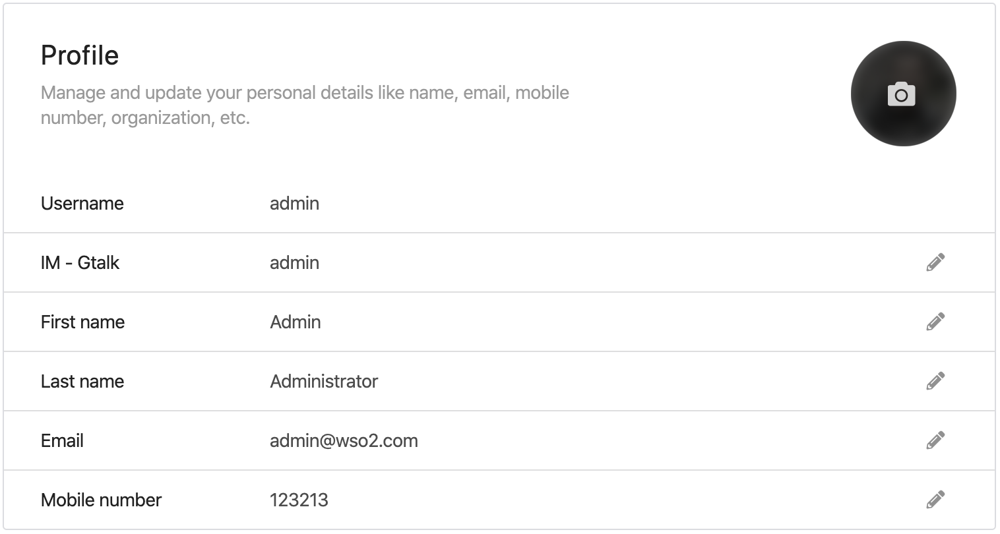
    
4. Enter the URL of the image that you wish to set as the profile picture in the textbox in the pop-up.

    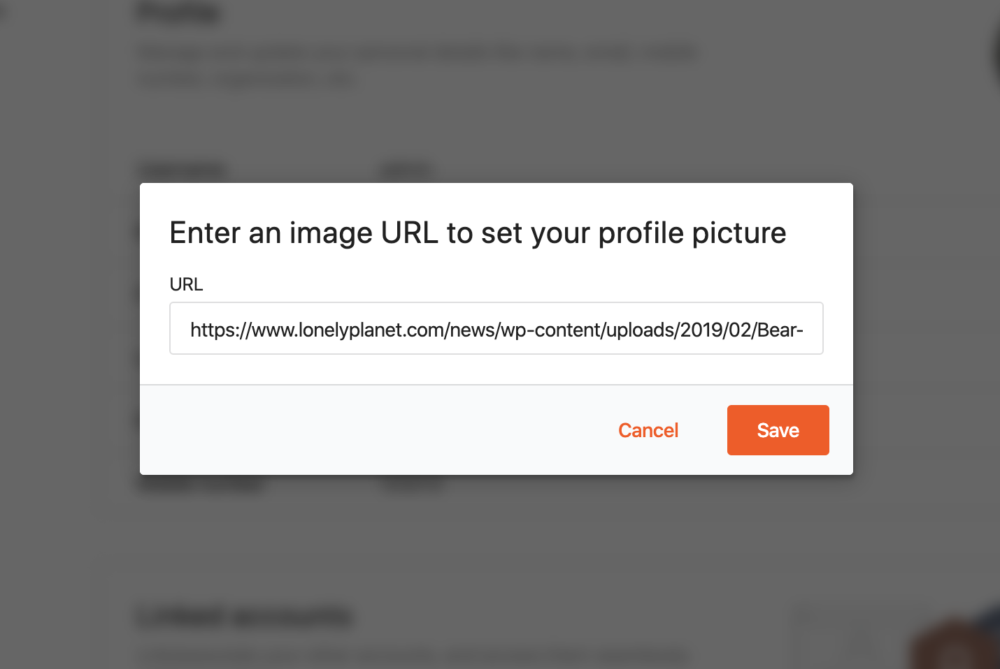

---

## Linked Accounts

WSO2 Identity Server (WSO2 IS) allows you to link multiple accounts you may have and switch between accounts, once you link your accounts. WSO2 IS also allows you to connect your federated user credentials with your WSO2 Identity Server account. The user portal allows you to link and manage your other local and federated accounts seamlessly.

### Link new accounts

1. [Access the user portal](#accessing-the-user-portal-and-its-components).
2. Click the **Personal info** tab on the side panel.
3. Under the linked account sub section, click **Add account**.

    

4. Enter the username and the password of the account you need to link and click **Save**.

    

### Delete linked accounts

1. [Access the user portal](#accessing-the-user-portal-and-its-components).
2. Click the **Personal info** tab on the side panel.
3. Click on the **delete** button aligning with the linked account you need to delete.
4. Confirm the deletion of the linked account by clicking **OK** in the confirmation popup alert.

---

## Export user profile

Using the **export user profile** feature in the user portal, you can download a JSON file to include your personal information, consents, and other claims. This will allow the user to get an idea about what information about them is recorded in the WSO2 identity server.

!!! tip
    The consent receipts in the
    `           userInfo.json          ` file contain the PII controller information 
    as it is, at the time that the receipt is generated. If the PII controller has 
    changed after the receipt was generated, this change will not be reflected in the 
    existing receipts. To get an updated consent receipt that reflects the change, 
    generate a new consent receipt by doing one of the following:

    1.  Revoke the consent via the user portal and go through the flow that prompts 
        the relevant consent again (i.e., revoke the given consent for an application 
        in WSO2 IS, log out, then log back in. Now approve the consent again. A new consent 
        receipt will be generated for that application consent).

    2.  Use the [Consent Management REST APIs](../../develop/using-the-consent-management-rest-apis) to revoke the
        existing consent and add a new consent.

You can export your profile by following the instructions given below.

1. [Access the user portal](#accessing-the-user-portal-and-its-components).
2. Click the **Personal info** tab on the side panel.
3. Under the **Export profile** sub section click on the **Download as JSON** button and all your profile details will be             downloaded to your local machine as a JSON file.

    

---

## Reset password

We usually advise the users to reset their passwords regularly as a security measure. Using the user portal, now you can change your password without a hassle. In order to change the password using the user portal, follow the instructions given below.

1. [Access the user portal](#accessing-the-user-portal-and-its-components).
2. Click the **Security** tab on the side panel.
3. Under the **Change password** sub section click **Change your password**.
4. Enter your current password and your new password twice in order to confirm the new password, and click **Submit**.     

---

## Account recovery

The account recovery feature implemented in the WSO2 Identity Server helps to recover the user account if the user has forgotten the username or password. This recovery process is also secured with captcha verification.

The main part of account recovery is setting up security or challenge questions for user accounts. With the WSO2 Identity Server, you can set up challenge questions in different languages.

The user portal allows users to add and update their challenge questions and update the email address that they can use to recover their accounts when required. Follow the instructions given below to use the account recovery options available in the user portal more effectively.

### Add security questions

1. [Access the user portal](#accessing-the-user-portal-and-its-components).
2. Click **Security tab** on the side panel.
3. Under the **Account recovery** sub section, click on the **add** button aligning with the **security questions** section.
4. Select two questions from the sets questions given in the dropdown list and enter a unique answer that is only known to you. Make sure you remember these answers as they will be used to recover your account when required.
5. Click on **Save** to submit the questions and answers you configured.

### Update security questions

1. [Access the user portal](#accessing-the-user-portal-and-its-components).
2. Click the **Security** tab on the side panel.
3. Under the **Account recovery** sub section, click on the **edit** icon, aligning with the security question you need to update.
4. Select a new question and add an answer, or just update the answer to the question you previously chose and click on **Save**.

### Add recovery email

1. [Access the user portal](#accessing-the-user-portal-and-its-components).
2. Click the **Security** tab on the side panel.
3. Click on the **add** button aligning with the **Email recovery** section.
4. Enter an email address that you wish to use as your recovery email and click **update**.

    !!! info
        Please note that this will be added as your email address in your profile.

### Update recovery email

1. [Access the user portal](#accessing-the-user-portal-and-its-components).
2. Click the **Security** tab on the side panel.
3. Click on the **edit** button with the pencil icon aligning with the Email recovery section.
4. Edit the email address that you already have to use as your recovery email and click on the **update** button.

    !!! info
        Please note that this will update the email address in your profile as well.

---

## Multi-factor authentication

MFA creates a layered defense and makes it more difficult for an unauthorized person to access a target such as a physical location, computing device, web service, network, or database. If one factor is compromised or broken, the attacker still has at least one more barrier to breach before successfully breaking into the target. WSO2 Identity Server allows configuring multi-step authentication where you can define an authentication chain containing different authenticators in different steps.

Using the latest user portal, users can update their mobile numbers through which they can authenticate themselves using the one-time verification code. Also, they can add inherence factors like FIDO devices and fingerprint sensors. The following section will provide instructions on how to configure MFA options in WSO2 IS using the user portal.

### Via SMS

1. [Access the user portal](#accessing-the-user-portal-and-its-components).
2. Click the **Security** tab on the side panel.
3. Under the **Multi-factor authentication** section, click on the **edit** icon aligning with **via SMS** section.
4. Enter the mobile number you need to add as the MFA factor and click **update**.

    !!! info
        This will also update your mobile number in the user profile.

### Via security device

!!! info
     This is supported by only a few browsers namely Chrome, Mozilla Firefox, and Microsoft Edge.

#### Add security device

1. [Access the user portal](#accessing-the-user-portal-and-its-components).
2. Click the **Security** tab on the side panel.
3. Under the **Multi-factor authentication** section, click on the **add** icon aligning with **via security device** section.
4. Select an option depending on whether you wish to add a USB security key or a built-in sensor.

    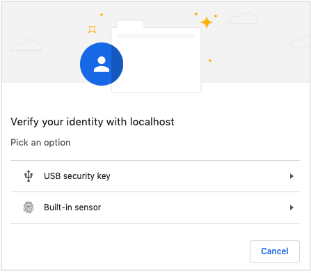

5. Click on **Continue**. You can also click on the **Choose another option** dropdown and switch your option.

    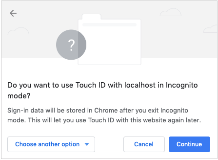
 
6. Click on **Continue**. You can also click on the **Choose another option** dropdown and switch your option.

    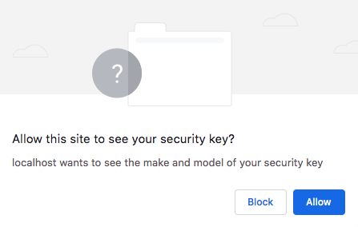
    
7. Add the preferred device name.

    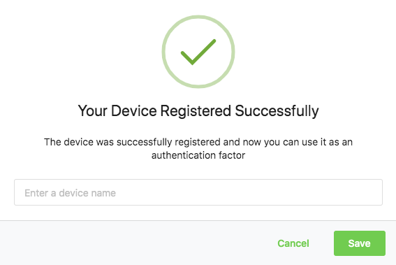

8. Once you have successfully added your device, you will see the device registration listed along with its name.

    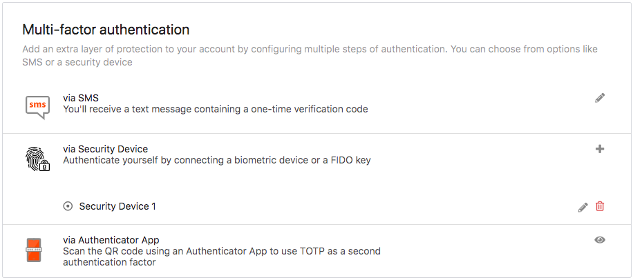
    
!!! info "Using an older FIDO device"

    If you are using an old FIDO device when registering the device, an error message mentioning that the device cannot be used will be displayed. 
    This means the device is not capable of performing [passwordless authentication](../learn/passowrdless-authentication-using-fido2.md) and can only be used as a [second factor](../learn/multi-factor-authentication-using-fido.md). The device will have to be added as an **Older Device**.

    
    Follow the steps given below to add the device as an older device.
    
    1. Click **close**.
    
        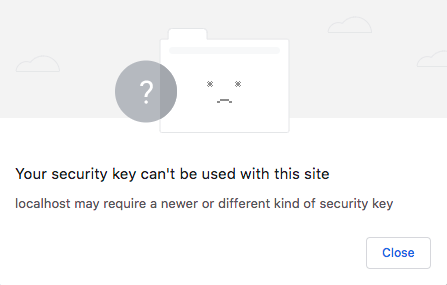
    
    
    2. Click **Try with an older Device**.
    
        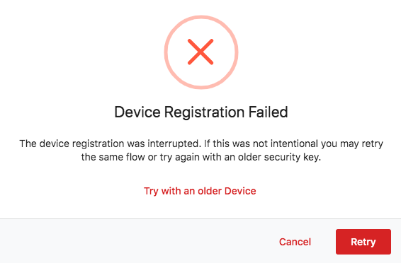
    
    
    3. From this point onwards, the steps to register the device are the same as the steps given in [Add security device](#add-security-device).

#### Delete security device

You can simply remove any security devices registered under MFA by clicking the **delete** icon.

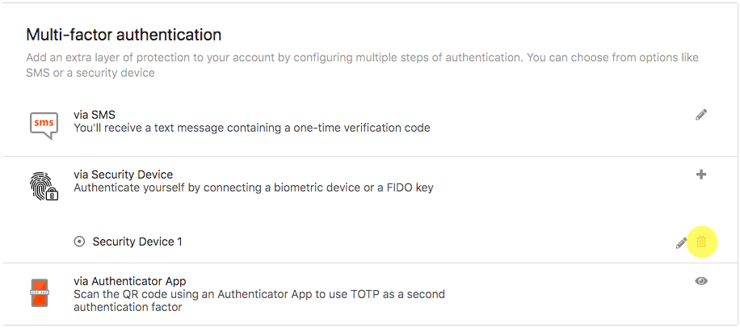

---

## Monitor active user sessions

The **Active user sessions** section in the user portal enables users to view details relating to the sessions of the different applications that are accessed via WSO2 IS. When you click on the **show more** button aligning with a specific session, it will display a detailed view of the session including the operating system, ip address, applications list, login time, and the last accessed time.

Depending on the user’s preference, the user portal allows the users either to terminate all the sessions at once or terminate sessions one by one. By clicking the **terminate all** button at the top right corner, users can terminate all the active sessions with a single button click. If they wish to terminate a specific session, they can click on the **terminate session** in the **detailed view** section.

---

## Consent management

WSO2 IS provides a comprehensive consent management solution that can be used to manage consents related to Identity and Access Management (IAM), and also to manage consents that belong to third party applications.
The user portal allows users to revoke or edit the consent given to applications registered in the WSO2 Identity Server. In order to edit or revoke application consents, refer to the instructions given below.

### Revoke consent

1. [Access the user portal](#accessing-the-user-portal-and-its-components).
2. Click the **Security** tab on the side panel.
3. Under the **Manage consent** section, click on the **Revoke** button aligning with the application for which your consent needs to be revoked. 

### Edit consent

1. [Access the user portal](#accessing-the-user-portal-and-its-components).
2. Click the **Security** tab on the side panel.
3. Under the **Manage consent** section, click on the **edit** icon aligning with the application for which your consent needs to be edited. 
4. Click and disable the toggle button aligning with any claim you wish, to revoke your consent.

5. Click **update**.

---

## Review pending approvals

The WSO2 Identity Server enables you to have more control over the tasks that are executed in it by using workflows. This is particularly useful in a scenario where you are approving user accounts in the Identity Server. Workflows provide you with the flexibility to configure this approval process in the way that suits your scenario.

The user portal allows you to review the workflow operations like adding users, updating user claims, deleting users and approving or denying them. For the convenience of the users, we have categorised the pending approvals into three states which are **ready, reserved and completed**.

For example, suppose you need to approve all the user creations in the identity server. Whenever a user gets created in the system, that task will appear under the **ready** section waiting for your approval. Whenever you review a task and claim it, that task will be listed under the **reserved** section of approvals. Once you approve or deny the task, it will appear under the **completed** section.

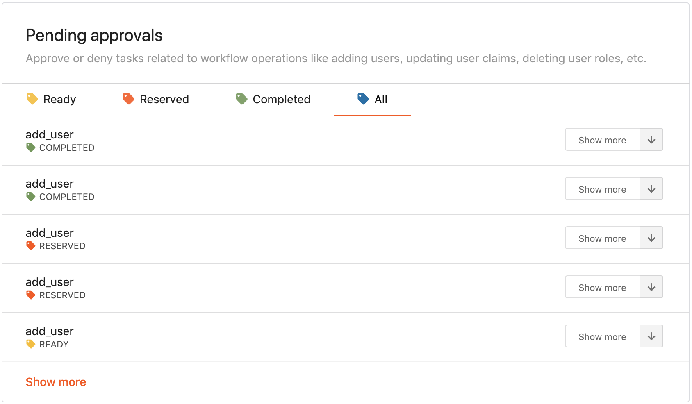
