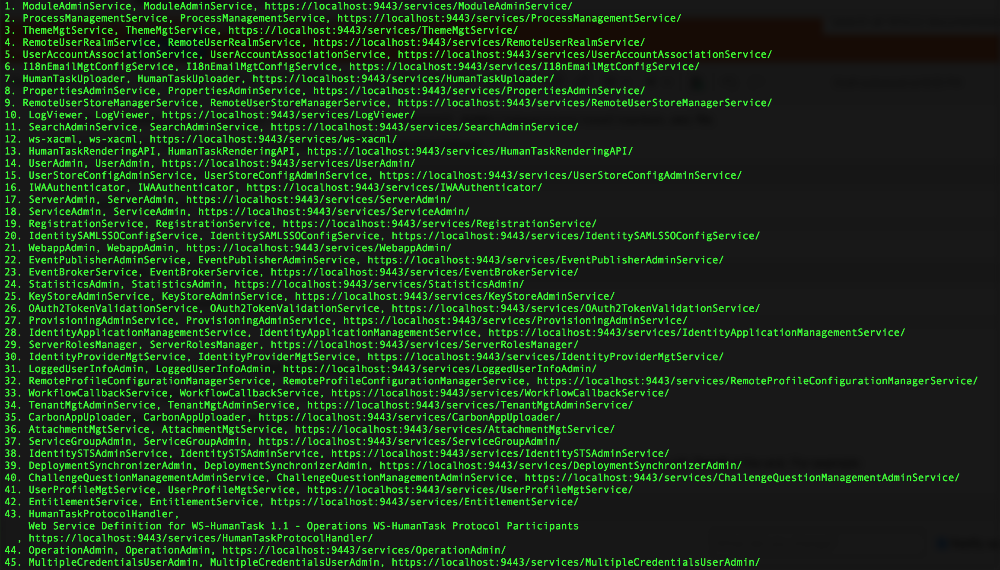

# Calling Admin Services

WSO2 products are managed internally using SOAP Web services known as
**admin services**. WSO2 products come with a management console UI,
which communicates with these admin services to facilitate
administration capabilities through the UI.

A service in WSO2 products is defined by the following components:

-   Service component: provides the actual service
-   UI component: provides the Web user interface to the service
-   Service stub: provides the interface to invoke the service generated
    from the service Web Services Description Language ( WSDL).

There can be instances where you want to call back-end Web services
directly. For example, in test automation, to minimize the overhead of
having to change automation scripts whenever a UI change happens,
developers prefer to call the underlying services in scripts. The topics
below explain how to discover and invoke these services from your
applications.

### Discovering the admin services

By default, the WSDLs of admin services are hidden from consumers. Given
below is how to discover them using the
[OSGi](https://www.osgi.org/developer/) console.

1.  Add the following configuration to the `<IS_HOME>/repository/conf/deployment.toml` file.
   
       ``` 
       [admin_service.wsdl] 
       enable= true
       ```
 
    
2.  Go to `           <PRODUCT_HOME>/bin/          ` folder and start
    the WSO2 product as follows,

    ``` java tab="In Linux Environment"
    sh wso2server.sh -DosgiConsole
    ```

    ``` java tab="In Windows Environment"
    wso2server.bat -DosgiConsole
    ```

3.  Once the server starts, hit the enter/return key several times to
    get the OSGI shell in the console.

4.  In the OSGI shell, type: `          listAdminServices         `

5.  The list of admin services of your product are listed. For
    example:  
     

**Things to note!**

!!! info
    To see the service contract of an admin service, select the admin
    service's URL and then paste it in your browser with **?wsdl** at the
    end. For example:

    `https://localhost:9443/services/RemoteUserStoreManagerService?wsdl`

    You should be accessing the Admin Services via the management console
    port, which is 9443 when there is no port offset.

!!! note 
    The admin service's URL appears as follows in the list you discovered in step 6:

    ``` java
    RemoteUserStoreManagerService, RemoteUserStoreManagerService, https://<host IP>:9443/services/RemoteUserStoreManagerService/  
    ```
    
    After discovering admin service you can restart the server without
    `           -DosgiConsole          `
    

###  Invoking an admin service

!!! tip
    To generate the stubs, you can write your own client program using the Axis2 client API or use an existing tool like [SoapUI](http://www.soapui.org/) (4.5.1 or later).
    
    
!!! info "Related Links"
    -   See [Permissions Required to Invoke Admin Services](../../references/permissions-required-to-invoke-admin-services) for a list of the operations that can be performed with different permission levels.
    -   The following article guides you through transforming existing SOAP-based services into REST services in WSO2 Identity Server: [Exposing WSO2 Identity Server Admin Services the REST Way](http://wso2.com/library/articles/2016/10/article-exposing-wso2-identity-server-admin-services-the-rest-way/#step2).
