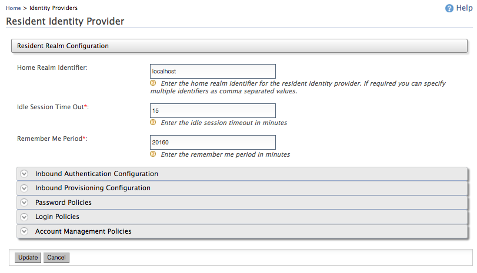

# Configuring Session Timeout

## Idle Session Time Out

This is the duration in minutes for which an SSO session can be idle
for. If WSO2 Identity Server does not receive any SSO authentication
requests for the given duration, a session time out occurs. The default
value is `15` minutes.

## Remember Me Period
This is the duration in weeks for which WSO2 Identity Server should
remember an SSO session given that you have selected the **Remember Me**
option in the WSO2 Identity Server login screen. The default value is
`2` weeks.

## Configuration
The session timeout value can be configured tenant wise using the
management console.

To configure the **Session Timeout** and **Remember Me period** in tenant
wise, follow the steps below:

1.  Start the IS server and login to the management console.
2.  Click **Resident** under **Identity Providers** on the **Main** tab.
3.  Fill in the fields as seen below to configure the session timeout
    and RememberMe period.  
     
    
    !!! Tip "You can configure these timeout values globally" 
        The global configuration can be added in the
        `<IS_HOME>/repository/conf/deployment.toml` file as shown below.
        ```
          [session.timeout]
          idle_session_timeout= "15m"
          remember_me_session_timeout= "14d"
        ```
    
        Restart the server to save the changes. Once you add these global configurations, each tenant that is created after adding the configuration will inherit the same configurations.
        
!!! note 
    With every authentication, the value of `remember_me_session_timeout` is updated for each user. To disable extending this expiry time with each authentication request, add the following configuration to the `<IS_HOME>/repository/conf/deployment.toml` file. 
    
    ``` toml
    [session.timeout]
    extend_remember_me_session_timeout_on_auth=false
    ```

Now the SSO session is timed out according to the newly configured value
and users need to be re-authenticated once the session times out. If a
timeout is not configured, the SSO session simply uses the 15 minutes
default time out value.

!!! info "Related Topics"

    -   After configuring the session timeout **,** see the [Configuring
        Inbound Authentication for a Service
        Provider](../../learn/configuring-inbound-authentication-for-a-service-provider)
        page to setup Single Sign On with WSO2 Identity Server.
    -   See [Single
        Sign-On](../../learn/single-sign-on) for
        more information.
