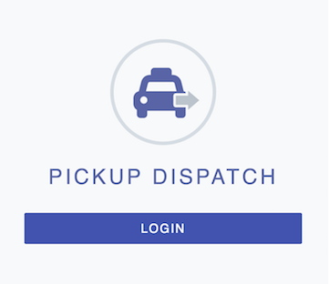

# Configuring Single Sign-On Using OpenID Connect

Single sign-on (SSO) is a key feature of the WSO2 Identity Server that enables
users to access multiple applications using the same set of credentials.This tutorial allows you to have hands-on experience on how to configure SSO with WSO2 Identity Server using the OpenID Connect protocol. 

To read more about single sign on with WSO2 Identity Server, see [Single Sign On](../../learn/configuring-single-sign-on).

## Scenario

Pickup is a cab company that has two SAML web applications called **pickup-dispatch** and **pickup-manager**. Both applications use WSO2 IS as the identity provider. When SSO is configured for both these applications, a user is only required to provide their credentials to the first application and the user will be automatically logged in to the second application.


## Set up

1. [Download WSO2 Identity Server](https://wso2.com/identity-and-access-management/).
2. Navigate to `<IS_HOME>/bin` and start the server by executing one of the following commands.

    ``` java tab="Linux/MacOS"
    sh wso2server.sh
    ```

    ``` java tab="Windows"
    wso2server.bat run
    ```
    
3. Follow the steps in [deploying pickup-dispatch webapp](../../learn/deploying-the-sample-app/#deploying-the-pickup-dispatch-webapp) to download, deploy and register dispatch sample.
4. Follow the steps in [deploying pickup-manager webapp](../../learn/deploying-the-sample-app/#deploying-the-pickup-manager-webapp) to download, deploy and register manager sample.

You are now ready to try out OpenID Connect SSO with the Pickup Dispatch and Pickup Manager sample web applications.

    !!! note
        To avoid errors while redirecting to the home page of the Pickup Dispatch and Pickup Manager applications, upgrade the Tomcat server to the latest version.

## Try it out
1. Navigate to <http://localhost.com:8080/pickup-dispatch> on your browser and click **Login**.

    

2. You will be redirected to the login page of WSO2 Identity Server. Log in using your WSO2 Identity Server credentials (admin/admin). Provide the required consent.
You will be redirected to the Pickup Dispatch application home page.

3. Now, if you navigate to <http://localhost.com:8080/pickup-manager> and click **Login**, you can see that user has been automatically logged in to this application without being prompted for user credentials.

You have successfully configured OpenID Connect Single Sign-On for two web applications using WSO2 Identity Server as the identity provider. 