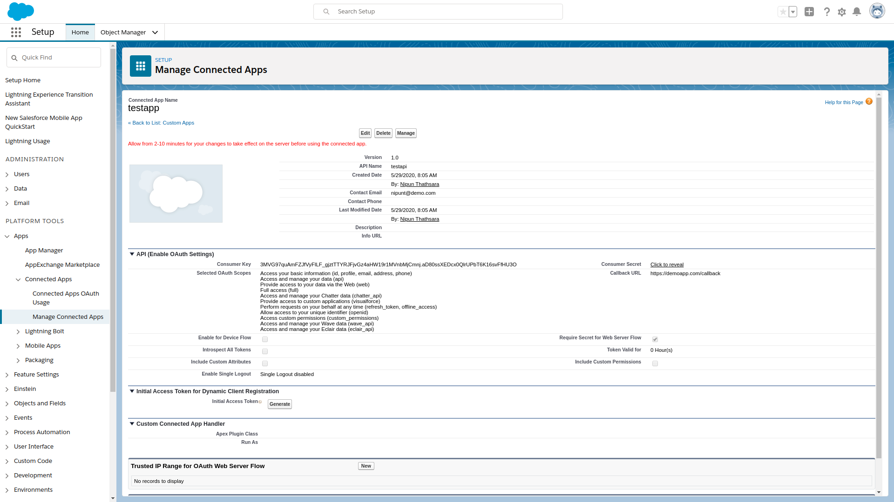
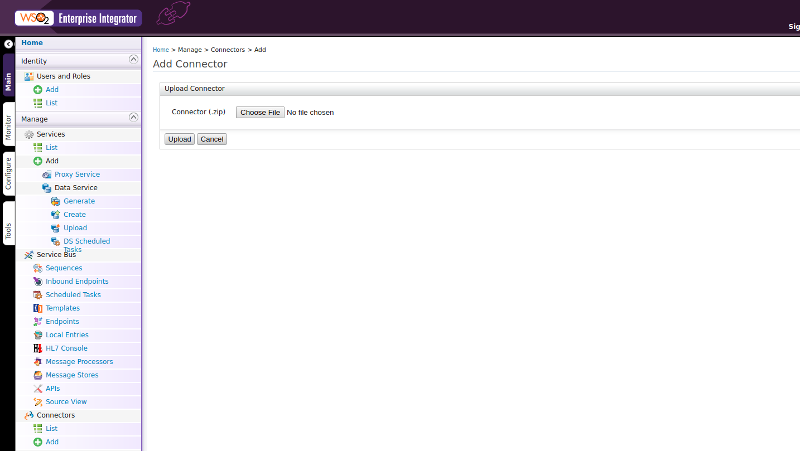
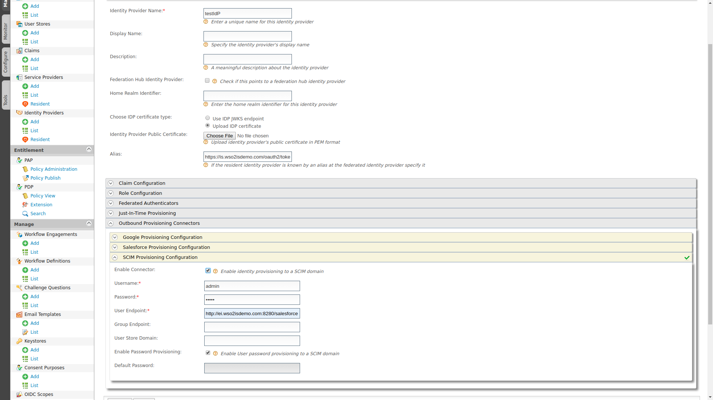

This tutorial will walk you through the steps on integrating WSO2 Identity Server with Salesforce for provisioning
users by utilizing WSO2 Enterprise Integrator as the message coordinator. The use-case is that, whenever a user is
created in WSO2 Identity Server, the same user needs to be created as a ‘Lead’ in Salesforce.

## Configuring Salesforce
1.  Create a [trial Developer account](https://login.salesforce.com/) in Salesforce.
2.  Create a new **Connected App** from **Platform Tools > App Manager > New Connected App** as shown in the diagram
below.


3.  Select all the scopes, provide a call back URL for your application and create your new Connected oauth application.

4.  Once you create it, you will be redirected to the next page with Oauth client key and client secret as below.



## Configure the WSO2 Enterprise Integrator (EI)

In order to enable WSO2 Enterprise Integrator Server (WSO2 EI) to be able to communicate with Salesforce using REST
APIs exposed by the Salesforce platform, you need to install WSO2 EI Salesforce REST connector. Please follow the
steps given below.

1.  Download the [Enterprise Integrator](https://wso2.com/enterprise-integrator/).
2.  Download the **Salesforce REST Connector** from the [WSO2 Connector Store](https://store.wso2
.com/store/pages/top-assets).
3.  Start the EI server and install the downloaded REST connector. From the EI management console, navigate to
**Connectors > Add > Upload**
    
4.  Add below two sequences from `Sequences > Add Sequence`
    ```xml
        <?xml version="1.0" encoding="UTF-8"?>
        <sequence name="create" xmlns="http://ws.apache.org/ns/synapse">
            <property expression="json-eval($.sObject)" name="sObject"
                scope="default" type="STRING" xmlns:ns="http://org.apache.synapse/xsd"/>
            <property expression="json-eval($.fieldAndValue)"
                name="fieldAndValue" scope="default" type="STRING" xmlns:ns="http://org.apache.synapse/xsd"/>
            <salesforcerest.init>
                <username>nipunt@wso2.com</username>
                <password>admin123</password>
                <apiVersion>v48.0</apiVersion>
                <hostName>https://login.salesforce.com</hostName>
                <clientSecret> ye3gf9yfgfn34fn9f3fg3f3f3n</clientSecret>
                <clientId>8r439nr83smseyenx2gr</clientId>
                <apiUrl>https://ap17.salesforce.com</apiUrl>
                <registryPath>connectors/SalesforceRest</registryPath>
            </salesforcerest.init>
            <property name="uri.var.apiUrl" value="https://ap17.salesforce.com"/>
            <salesforcerest.create>
                <sObjectName>{$ctx:sObject}</sObjectName>
                <fieldAndValue>{$ctx:fieldAndValue}</fieldAndValue>
            </salesforcerest.create>
        </sequence>

        <?xml version="1.0" encoding="UTF-8"?>
        <sequence name="retrieve" xmlns="http://ws.apache.org/ns/synapse">
            <salesforcerest.init>
                <username>nipunt@wso2.com</username>
                <password>admin123</password>
                <apiVersion>v48.0</apiVersion>
                <hostName>https://login.salesforce.com</hostName>
                <clientSecret> ye3gf9yfgfn34fn9f3fg3f3f3n</clientSecret>
                <clientId>8r439nr83smseyenx2gr</clientId>
                <apiUrl>https://ap17.salesforce.com</apiUrl>
                <registryPath>connectors/SalesforceRest</registryPath>
            </salesforcerest.init>
            <property name="uri.var.apiUrl" value="https://ap17.salesforce.com"/>
            <property name="apos" scope="default" type="STRING" value="'"/>
            <property
                expression="fn:concat('SELECT count() FROM Lead WHERE Email = ', $ctx:apos, get-property('uri.var.email'), $ctx:apos)"
                name="uri.var.queryString" xmlns:ns="http://org.apache.synapse/xsd"/>
            <call blocking="true">
                <endpoint>
                    <http method="GET" uri-template="{uri.var.apiUrl}/services/data/{uri.var.apiVersion}/query/?q={uri.var.queryString}">
                        <timeout>
                            <duration>{$ctx:timeout}</duration>
                            <responseAction>fault</responseAction>
                        </timeout>
                        <suspendOnFailure>
                            <errorCodes>-1</errorCodes>
                            <progressionFactor>1.0</progressionFactor>
                        </suspendOnFailure>
                        <markForSuspension>
                            <errorCodes>-1</errorCodes>
                        </markForSuspension>
                    </http>
                </endpoint>
            </call>
        </sequence>
    ```
    Replace `username`, `password`, `clientId`, `clientSecret` as per your created application.

5.  Create the below API from `API > Add API`
    ```xml
        <api xmlns="http://ws.apache.org/ns/synapse" name="salesforcerest" context="/salesforce">
           <resource methods="POST">
              <inSequence>
                 <property name="uri.var.email" expression="json-eval($.emails[0])" scope="default" type="STRING"/>
                 <sequence key="retrieve"/>
                 <switch source="json-eval($.totalSize)">
                    <case regex="0">
                       <payloadFactory media-type="json">
                          <format>{"sObject":"Lead", "fieldAndValue": {"LastName" : "$1", "Company" : "Guardio", "Email" : "$1", "LeadSource" : "Guardio brochure download."}}</format>
                          <args>
                             <arg evaluator="xml" expression="get-property('uri.var.email')"/>
                          </args>
                       </payloadFactory>
                       <sequence key="create"/>
                    </case>
                 </switch>
                 <respond/>
              </inSequence>
              <outSequence/>
              <faultSequence/>
           </resource>
        </api>
    ```


##  Configuring the Identity Server

1.  Download the [WSO2 Identity Server](https://wso2.com/identity-and-access-management/).
2.  Add an Identity Provider to configure outbound provisioning as shown in the diagram below.
    
3.  In the `SCIM Provisioning Configuration`, provide the REST endpoint details of the EI server. If they are secured
 APIs, provide the credentials as well.
4.  Configure the `Resident Service Provider` to register the newly created Identity Provider for Outbound
Provisioning as shown below.
    


##  Try Out

1.  Send a simple SCIM request to WSO2 IS as shown below.
```
    curl -v -k --user admin:admin --data '{"schemas":[],"userName":"Robin","password":"robin123",
    "emails":["robin@wso2.com"]}' --header "Content-Type:application/json" https://localhost:9443/scim2/Users
```
In the above command, the **email** attribute will be the one that is consumed by the EI Salesforce Connector to create
 the `Lead` in the Salesforce. You can also send other parameters in this SCIM request and change the EI REST API
appropriately to capture the information and send to Salesforce.
2.  You can see the local user by searching the string `Robin` in the **Management Console > Users and Roles > Users >
 View**.
3.  Login to Salesforce and navigate to this [URL](https://ap17.lightning.force
.com/lightning/o/Lead/list?filterName=Recent) to see the created `Lead`.

!!! note

	This EI Salesforce REST connector makes use of the Salesforce REST APIs. Those REST APIs cater many
	functionalities in the Salesforce side. Therefore, the EI REST connector too supports execution of those APIs in
	a more convenient manner. Using this, you can achieve many user management scenario integrations with the WSO2
	Identity Server.
