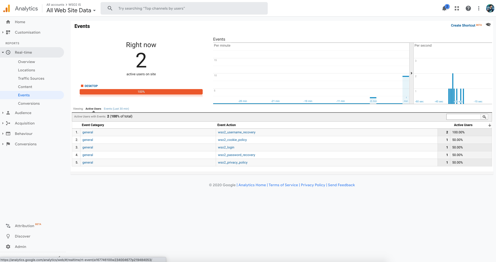
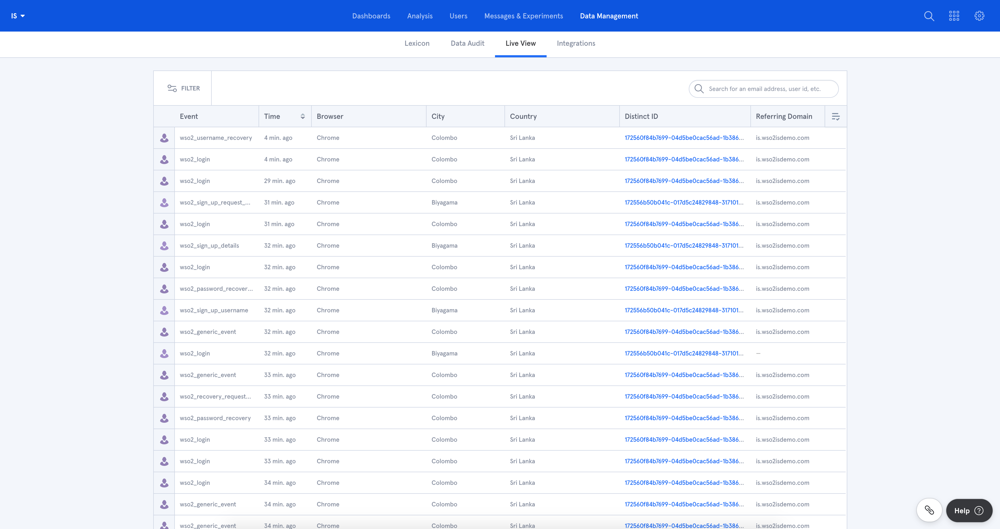

# Web Analytics Solutions

Web Analytics is used for the purpose of identifying the way users interact with web pages. WSO2 Identity Server supports the integration of both Google Analytics and Mixpanel. Getting the Identity Service to fire events at different pages is easy enough. You can choose to enable either or both of the analytics services.

## Setting up web analytics

1. Download the [samples-is](https://github.com/wso2/samples-is/archive/master.zip) repository and extract its content.

2. Open the `config.jsp` file in the `analytics-extensions` directory and replace the relevant token string of the analytics service that needs to be enabled.

    1. Get a Google Analytics token.
        1. Create a Google Analytics project.
        2. Go to **Admin** -> **Tracking Info** -> **Tracking Code**.
        3. Look for the token of your project inside, 
        `gtag('config', '<TOKEN>');`.

    2. Get a Mixpanel token.
        1. Create a Mixpanel project.
        2. Go to **Settings** -> **Set up Mixpanel**.
        3. Look for the token of your project inside, 
        `mixpanel.init("<TOKEN>");`.

3. Replace the following files inside the `<IS_HOME>` directory with the respective files in the `analytics-extensions` directory.

|                                        Original file                                       	|                            File to replace                           	|
|:------------------------------------------------------------------------------------------:	|:--------------------------------------------------------------------:	|
| IS_HOME/repository/deployment/server/webapps/ authenticationendpoint/includes/localize.jsp  	| samples-is/analytics-extensions/authenticationendpoint/localize.jsp  	|
| IS_HOME/repository/deployment/server/webapps/ accountrecoveryendpoint/includes/localize.jsp 	| samples-is/analytics-extensions/accountrecoveryendpoint/localize.jsp 	|

4. Copy the analytics.jsp and config.jsp files inside the analytics-extensions  directory  to both the `authenticationendpoint/include` and `accountrecoveryendpoint/include` directories in the `<IS_HOME>` directory.

5. Run [WSO2 Identity Server](https://is.docs.wso2.com/en/latest/setup/running-the-product/#running-the-product) instance in the usual way and the analytics events will be fired when the users access the relevant web pages. 

## Types of analytic events

The following events are captured after enabling the analytics integration in the WSO2 Identity Server. 

| Event name                        	| Description                                                                                    	|
|-----------------------------------	|------------------------------------------------------------------------------------------------	|
| `wso2_generic_event`              	| A generic type of event that will be fired unless the event belongs to one of the types below. 	|
| `wso2_error`                      	| An error has occurred.                                                                         	|
| `wso2_login`                      	| The login page has been visited.                                                               	|
| `wso2_login_failure`              	| Login has failed.                                                                              	|
| `wso2_sign_up_username`           	| Self sign up username page has been visited.                                                   	|
| `wso2_sign_up_details`            	| Self sign up user detail collection page has been visited.                                     	|
| `wso2_sign_up_request_complete`   	| A request for a self sign up has been completed.                                               	|
| `wso2_sign_up_process_complete`   	| A sign up flow has been completed including the confirmation.                                  	|
| `wso2_username_recovery`          	| Username recovery page has been visited.                                                       	|
| `wso2_password_recovery`          	| Password recovery page has been visited.                                                       	|
| `wso2_recovery_request_complete`  	| Request for a username/password recovery is complete.                                          	|
| `wso2_password_recovery_reset`    	| Password reset page has been visited.                                                          	|
| `wso2_password_recovery_complete` 	| A password recovery flow has been successfully completed.                                      	|
| `wso2_privacy_policy`             	| Privacy policy page has been visited.                                                          	|
| `wso2_cookie_policy`              	| Cookie policy page has been visited.                                                           	|

## View analytics

You can view the analytics events for your application through the Google Analytics and Mixpanel dashboards. 

### Google Analytics
 

### Mixpanel
 
