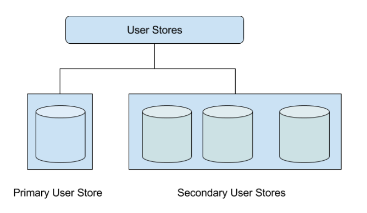

# Configuring User Stores

WSO2 Identity Server products allow configuring multiple user stores to your system that
are used to store users and their roles (Groups). Out of the box WSO2
Identity Server support JDBC, LDAP and Active Directory user stores with the
capability of configuring custom user stores. There are different user
store adapters called *User store managers*, which are used to connect
with these users store types.

There are two types of user stores - Primary User store (Mandatory) and
Secondary user stores (Optional). All the supported user stores can be
configured under these two types.

 

## Primary User Store (Mandatory)

This is the main user store that is shared among all the
[tenants](../../administer/introduction-to-multitenancy)
in the system. Only one user store should be configured as the primary
user store and it is configured in the
`         <IS_HOME>/repository/conf/deployment.toml       ` file.By default,
WSO2 identity server uses an embedded Read/Write LDAP as the primary user store.
It is recommended to change this default configuration in the production
system.

see, [Configuring the Primary User Store](../../setup/configuring-the-primary-user-store)

## Secondary User Store(s) (Optional)

Any number of secondary user stores can be easily set up for your system
and these user stores are specific to the created tenant, and they are
not shared among multiple tenants.  
You can use the management console to create secondary user stores or
you can create them manually. These will be stored in a xml with the
configurations corresponding to the secondary user store.

see, [Configuring a Secondary User Store](../../setup/configuring-secondary-user-stores)

## User Store Manager

Adapters used to connect with different users stores are called *User
Store Managers*. By default, there are user store managers for JDBC,
LDAP and Active Directory user stores. If you need to add a new user
store implementation, see [Writing a Custom User Store
Manager](../../setup/writing-a-custom-user-store-manager). When you configure the
user store, you have to set the user store manager class name.

!!! info 
    The permissions attached to roles are always stored in an RDBMS. With
    the default configurations, permissions are stored in the embedded H2
    database. For information on how to set up a RDBMS repository for
    storing permission, see [Configuring the Authorization
    Manager](../../setup/configuring-the-authorization-manager)

The following topics include instructions on setting up different user stores.