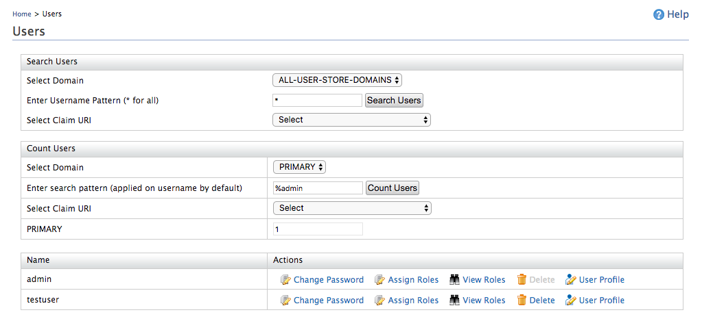
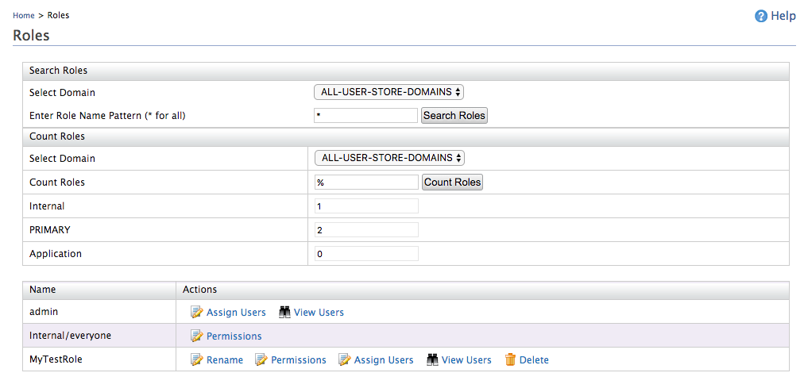

# Counting Users and User Roles

WSO2 Identity Server enables easily counting the users and user roles using the **Management Console** and **Admin Services**. 

!!! tip "Before you begin"
    1.  Open the `deployment.toml` file in the `<IS_HOME>/repository/conf` directory and add the following configuration.

        ``` toml
        [user_store]
        count_retriever_class = "org.wso2.carbon.identity.user.store.count.jdbc.JDBCUserStoreCountRetriever"
        ```

    3.  [Start WSO2 Identity Server](../../setup/running-the-product/).  
      
Let's get started! 

## Counting via Management Console 

Follow the steps below to count users via the Managemet Console: 

1.  On the **Main** menu of the Management Console, click **Identity > Users and Roles > List**.
2.  To count users:
    1.  Click **Users**.
    2.  Click **Count Users**. Note that you can count the number of users in each domain for different claims, user name patterns, etc. 

        !!! example  
            In this example, `%admin` is given as search pattern.
             

3.  Similarly, to count user roles:
    1.  Click **Roles**.
    2.  Click **Count Roles**. Note that you can count the number of user roles in different user store domains.

        !!! example
             

## Counting via Admin Services

Follow the steps below to count users via the Admin Services:

1.  To gain access to the WSDL's of the admin services, open the `deployment.toml` file in the `<IS_HOME>/repository/conf` directory and set following configuration to `true`.
    
    ``` toml  
    [admin_service.wsdl]
    enable = true
    ```

2.  Access the WSDL of UserStoreCountService service by browsing <https://localhost:9443/services/UserStoreCountService?wsdl>. 
    If the WSDL is loading, access the methods of the service through SoapUI. Here, you will have access to additional methods (`CountByClaimsInDomain`, `countClaims`) than from the Management
    Console.

!!! note     
    By default, only JDBC user store implementations supports this service but the functionality can be extended to LDAP user stores or any other type of user store as well.
    
