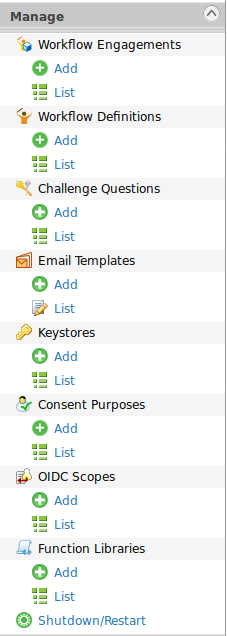
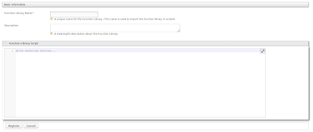
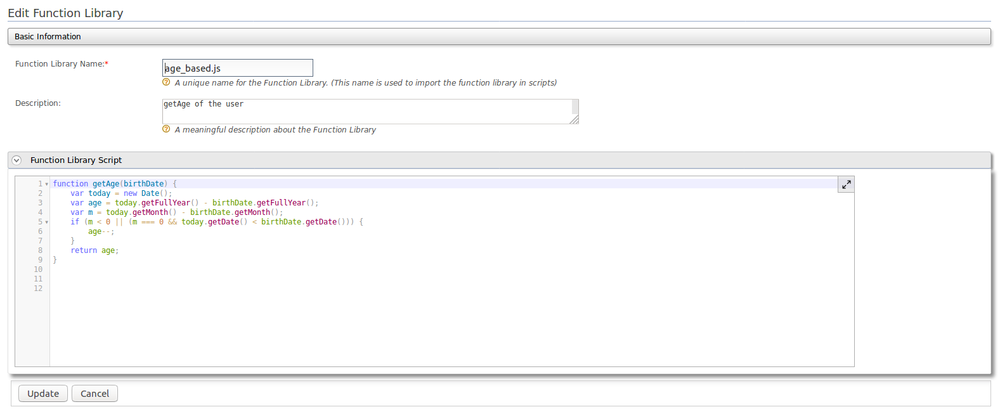
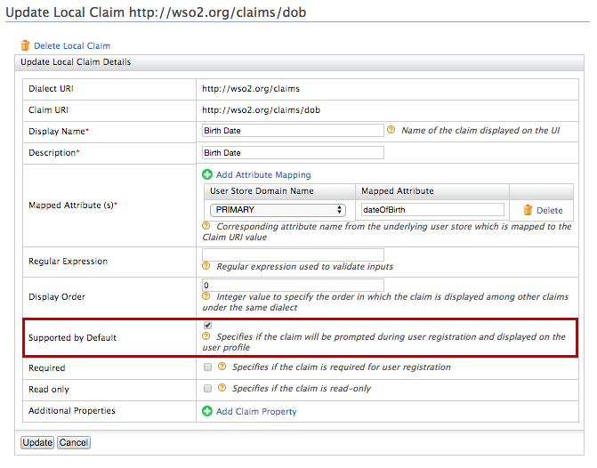

### Introduction


Script-based adaptive authentication in WSO2 Identity Server enables changing the 
authentication flow based on conditions in JavaScript. For this, each service provider 
needs to have its own set of Javascript functions. If the identity admin needs to have 
the same function for several service providers, the same JavaScript function needs to be 
duplicated. As a result, the process of managing authentication scripts gets difficult.

This feature supports a set of function libraries that can be imported in authentication 
scripts. Each function library contains a set of functions. These function libraries can be 
added, deleted, edited, imported, and exported via the WSO2 Identity Server Management Console.


### Adding a function library

Follow the steps below to add a function library using the Management Console,

1. Sign in to in to the Management Console.
2. On the Main menu, click Manage > Function Libraries >  Add.
   
    
   
3. Fill in the Function Library Name, provide a brief Description and write the
Function Library Script for the function library.

    

4. Click Register to add the new function library.


!!! Note

    When adding a function library script, the functions you are supposed to use in authentication 
    scripts need to be exported as follows.
    
    For example, when writing more than one function in one library you can use either of the following functions.
    
    **Option 1**
    
    Use this option if a function in the function library calls another function in the same library. 
    Make sure to export all the functions.
    
    `
    module.exports.<function_name_for_outside> = <function_name_in _the_script>
    `
    
    or
    
    `
    exports.<function_name_for_outside> = <function_name_in _the_script>
    `
    
    For example,
    ```javascript
    function getAge(birthDate) {
        var today = new Date();
        var age = today.getFullYear() - birthDate.getFullYear();
        var m = today.getMonth() - birthDate.getMonth();
        if (m < 0 || (m === 0 && today.getDate() <    birthDate.getDate())) {
            age--;
        }
        return age;
    };
    
    var validateDOB = function (dob) {
        return dob.match(/^(\d{4})-(\d{2})-(\d{2})$/);
    };
     
    module.exports.getAge = getAge;
    //or 
    //exports.getAge = getAge;
    module.exports.validateDOB = validateDOB;
    //or
    //exports.validateDOB = validateDOB;
    ```
    
    **Option 2**
    
    ```javascript
    var ageModule = {
        getAge : function (birthDate) {
            var today = new Date();
            var age = today.getFullYear() - birthDate.getFullYear();
            var m = today.getMonth() - birthDate.getMonth();
            if (m < 0 || (m === 0 && today.getDate() < birthDate.getDate())) {
                age--;
            }
            return age;
        },
        
        validateDOB : function (dob) {
            return dob.match(/^(\d{4})-(\d{2})-(\d{2})$/);
        }
    };
     
    module.exports = ageModule;
    ```
    
    
    **Option 3**
    
    ```javascript
    var ageModule = { };
    ageModule.getAge = function (birthDate) {
        var today = new Date();
        var age = today.getFullYear() - birthDate.getFullYear();
        var m = today.getMonth() - birthDate.getMonth();
        if (m < 0 || (m === 0 && today.getDate() < birthDate.getDate())) {
            age--;
        }
        return age;
    };
    
    ageModule.validateDOB = function (dob) {
        return dob.match(/^(\d{4})-(\d{2})-(\d{2})$/);
    };
     
    module.exports = ageModule;
    ```


### Managing function libraries

#### Viewing function libraries
Follow the instructions below to view the list of function libraries added in the WSO2 Identity Server.

1. Sign in to the Management Console.

2. In the Main menu, click Manage > Function Libraries > List. 

    Note that the list of function libraries you added appears.

    


#### Editing function libraries

Follow the instructions below to edit a function library's details.

1.  Sign in to the Management Console.

2.  In the Main menu, click Manage > Function Libraries > List.

    Note that the list of function libraries you added appears.

3.  Locate the function library you want to edit and click on the corresponding Edit link.

    

4. The edit screen appears. Function library’s name, description and script could be edited.

    


5. Click Update.

6. To confirm your request if you have edited the function library name, click the Yes.


#### Deleting function libraries

Follow the instructions below to delete a function library.

1. Sign in to the Management Console.

2. In the Main menu, click Manage > Function Libraries > List.

3. The list of function libraries you added appears.

    Locate the function library you want to delete and click on the corresponding Delete link.

    

4. To confirm your request, click the Yes.


##Including function libraries in adaptive authentication scripts

1. Register a function library.

2. Configure a service provider for adaptive authentication. 

    For instructions, see [Configuring a Service Provider for Adaptive Authentication](../../learn/configuring-a-service-provider-for-adaptive-authentication).

3. Under the Main menu of the Management Console, click Service Providers > List > 
Edit on the configured service provider.

4. Expand the Local and Outbound Authentication Configuration section 
and click Advanced Configuration.

5. Write the adaptive authentication script in the editor using the functions written in the added function library.

6. Add `var <module_name> = require('<function library name>');`

    (Eg: var ageModule = require('age_based.js');) on top of the script/ before the usage of functions in the function library.

7. Use the functions exported in the loaded function library, e.g., ageModule.getAge(birthday).


#### Try it out
##### Configuring the sample scenario

1. Follow the steps in adding a function library with following properties.
    
    Function Library Name: age_based
    Description: getAge of the user 
    Function Library Script: 
    
    ```javascript
    function getAge(birthDate) {
        var today = new Date();
        var age = today.getFullYear() - birthDate.getFullYear();
        var m = today.getMonth() - birthDate.getMonth();
        if (m < 0 || (m === 0 && today.getDate() < birthDate.getDate())) {
            age--;
        }
        return age;
    }
     module.exports.getAge = getAge;
    ```

2. To try out adaptive authentication with WSO2 Identity Server, you have to set up 
a sample application to test adaptive authentication scenarios, and configure a service provider 
for adaptive authentication in WSO2 Identity Server. 
For instructions on how to do this, see [Configuring a Service Provider for Adaptive Authentication](../../learn/configuring-a-service-provider-for-adaptive-authentication).

3. Sign in to the Management Console.

4. Click List under Claims and click http://wso2.org/claims. 

5. Click Edit that corresponds to the BirthDate claim and select the 
Supported By Default checkbox to enable the birth date claim. 

       

6. Create a user called "Alex" and edit the user profile. 

7. Enter a birth date that specifies Alex as under 18 years of age. 
    
    !!! note
        Enter the birth date in the following format: &lt;yyyy-mm-dd&gt;.

8. Create another user called "Kim" and edit the user profile. Enter a birth date that specifies Kim as over 18 years of age. 

9. In the Main menu, click Service Providers > List and click Edit on the 
saml2-web-app-pickup-dispatch.com service provider.

10. Expand the Local and Outbound Authentication Configuration section and 
click Advanced Configuration.

11. Under script based adaptive authentication editor, enter the following script.

    ```javascript
    var ageModule = require('age_based.js');
    
    // This script will only allow login to application if the user's age is over configured value
    // The user will be redirected to an error page if the date of birth is not present or user is below configured value
    
    var ageLimit = 18;
    
    // Error page to redirect unauthorized users,
    // can be either an absolute url or relative url to server root, or empty/null
    // null/empty value will redirect to the default error page
    var errorPage = '';
    
    // Additional query params to be added to the above url.
    // Hint: Use i18n keys for error messages
    var errorPageParameters = {
        'status': 'Unauthorized',
        'statusMsg': 'You need to be over ' + ageLimit + ' years to login to this application.'
    };
    
    // Date of birth attribute at the client side
    var dateOfBirthClaim = 'http://wso2.org/claims/dob';
    
    function onLoginRequest(context) {
        executeStep(1, {
            onSuccess: function (context) {
                var underAge = true;
                // Extracting user store domain of authenticated subject from the first step
                var dob = context.currentKnownSubject.localClaims[dateOfBirthClaim];
                Log.debug('DOB of user ' + context.currentKnownSubject.identifier + ' is : ' + dob);
                if (dob && ageModule.validateDOB(dob)) {
                    var birthDate = new Date(dob);
                    if (ageModule.getAge(birthDate) >= ageLimit) {
                        underAge = false;
                    }
                }
                if (underAge === true) {
                    Log.debug('User ' + context.currentKnownSubject.identifier + ' is under aged. Hence denied to login.');
                    sendError(errorPage, errorPageParameters);
                }
            }
        });
    }
    ```
    The authentication script and authentication steps get configured. 
    The authentication script grants access only to users who are 18 years or above 
    and restricts underage users. Underage users are redirected to an error page. 
    
    !!! note
        Add var ageModule=require('age_based.js'); before ageModule.getAge(birthDate) and ageModule.validateDOB(dob) functions’ usage.


12. Click Ok then Update.

##### Testing the sample scenario

1. Access the following sample PickUp application URL: http://localhost.com:8080/saml2-web-app-pickup-dispatch.com
2. Click Login and enter Kim's credentials. 
3. You are successfully logged in to the application.

    


4. Log out and login as Alex. Note that you are now restricted from logging in because Alex is underage.  

    
