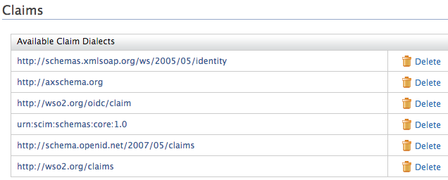
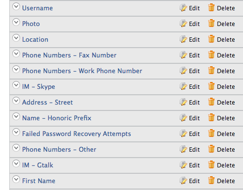
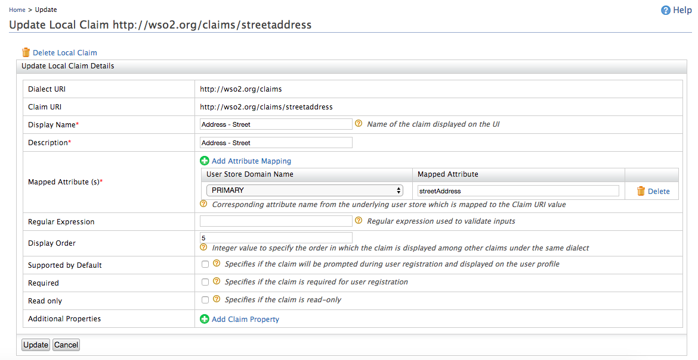

# Editing Claim Mapping

You can edit existing claims by clicking on any available claim link.
Follow the instructions below to edit a claim.

1.  Sign in. Enter your username and password to log on to the
    [Management Console](../../setup/getting-started-with-the-management-console).
2.  Click **Main** to access the **Main** menu and click **List** under
    **Claims**.
3.  Click on any available dialect links.  
    
4.  From the **Claim Dialect** view, you can view the claims defined for
    that particular dialect. Click on the appropriate **Edit** link.  
    
5.  Enter the new claim information in the required fields and click on
    the **Update** button.

    1.  If you are editing a local claim, you will see the following
        screen.

         

    2.  If you are editing an external claim, you will see the following
        screen.  
        

    !!! note

        When you are using [more than one user
        store](../../setup/configuring-secondary-user-stores), you must map the
        attributes correctly using claim management. Under “Mapped
        Attribute(s)” you need to follow the pattern.
    
        ``` java
        {domain_name/attribute_Name};{domain_name/attribute_Name}; {domain_name/attribute_Name};
        ```
    
        However, for the default user store, you do not need to provide the
        domain name. As an example, if you have two user stores, one is
        default and other one with domain “LDAP” then the pattern would be
        as follows for “
        `                       http://wso2.org/claims/emailaddress                     `
        ".
    
        ``` java
        email;LDAP/mail
        ```
    

!!! tip "Alternatively"  
    
    You can edit the file configuration in
    **<IS\_HOME\>/repository/conf/claim-config.xml** and start the server
    to view the changed claims.
    
    Note that the claims configured in `<IS_HOME>/repository/conf/claim-config.xml` file get applied only when you start the product for the first time, or for any newly created tenants. With the first startup, claim dialects and claims will be loaded from the file and persisted in the database. Any consecutive updates to the file will not be picked up and claim dialects and claims will be loaded from the database.
    
