# JMX-Based Monitoring

!!! info "Java Management Extensions (JMX)" 
    **JMX** is a technology that lets you implement management interfaces for Java applications. 
    A management interface, as defined by JMX, is composed of named objects called **MBeans** (Management
    Beans). MBeans are registered with a name (an ObjectName) in an **MBeanServer**. To manage a resource or many resources in your application, you can write an MBean defining its management interface and register
    that MBean in your MBeanServer. The content of the MBeanServer can then be exposed through various protocols, implemented by protocol connectors, or protocol adaptors.
  

### Configuring JMX in WSO2 Identity Server

JMX is enabled in WSO2 Identity Server by default ensuring that the JMX
server starts automatically. Additionally, you can enable JMX separately for the various datasources
that are used by WSO2 IS. Once JMX is enabled, you can log in to the
JConsole tool and monitor your WSO2 IS instance as explained in the [Monitoring WSO2 Identity Server with JConsole](#monitoring-wso2-identity-server-with-jconsole) section.

#### Configuring JMX ports for the server

The default JMX ports (RMIRegistryPort and the RMIServerPort) are
configured in the `         deployment.toml        ` file (stored in the
`         <IS_HOME>/repository/conf        ` directory) as shown
below. If required, you can update these default values.

``` toml
[monitoring.jmx]
rmi_registry_port = "9999"

[monitoring.jmx]
rmi_server_por = "11111"
```

#### Disabling JMX for the server

You can disable the JMX server by setting the following
property to ` false ` in the `deployment.toml` file.

```toml
[monitoring.jmx]
rmi_server_start = false
```

#### Enabling JMX for a datasource

You can enable JMX for a datasource by adding the `jmxEnabled` as `true`
element to the datasource configuration. For example, to enable JMX for
the default Carbon datasources, add the following
property to the ` deployment.toml` file (stored in the `
<IS_HOME>/repository/conf/ ` directory).

!!! abstract "For IDENTITY_DB"
    ``` toml
    [database.identity_db.pool_options]
    jmxEnabled = true
    ```

!!! abstract "For SHARED_DB"
    ``` toml
    [database.shared_db]
    ...
    jmx_enable = true
    ```

### Monitoring WSO2 Identity Server with JConsole

Jconsole is a JMX-compliant monitoring tool, which comes with the Java
Development Kit (JDK) 1.5 and newer versions. You can find this tool
inside your `         <JDK_HOME>/bin        ` directory. See the
instructions on [Installing the JDK](https://docs.oracle.com/javase/8/docs/technotes/guides/install/install_overview.html) for more information.

#### Starting WSO2 Identity Server with JMX

First, start WSO2 Identity Server:

1.  Open a command prompt and navigate to the
    `          <IS_HOME>/bin         ` directory.
2.  Execute the WSO2 IS startup script and start the server.

    ```shell tab="Linux"
    wso2server.sh
    ```

    ```shell tab="Windows"
    wso2server.bat 
    ```

    !!! tip 
        If JMX is enabled, the `JMX server URL`
        will be published on the console when the server starts as shown
        below.

        ```shell
        INFO {org.wso2.carbon.core.init.CarbonServerManager} -  JMX Service URL  : service:jmx:rmi://<your-ip>:11111/jndi/rmi://<your-ip>:9999/jmxrmi
        ```

Once the identity server has started, you can start the `JConsole        ` tool as follows:

1.  Open a command prompt and navigate to the
    `          <JDK_HOME>/bin         ` directory.
2.  Execute the `jconsole         ` command to open the
    log-in screen of the **Java Monitoring & Management Console** as
    shown below.  
    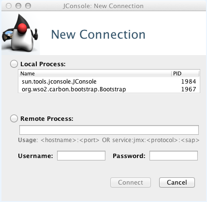 
3.  Enter the connection details in the above screen as follows:
    1.  Enter the **JMX server URL** in the **Remote Process** field.
        This URL is published on the command prompt when you start the
        WSO2 server as explained
        [above](#starting-wso2-identity-server-with-jmx).

        !!! tip 
            If you are connecting with a remote IP address instead of
            localhost, you need to bind the JMX service to the externally
            accessible IP address by adding the following system property to
            the product startup script stored in the
            `              <IS_HOME>/bin             ` directory (
            `              wso2server.sh             ` for Linux and
            `              wso2server.bat             ` for Windows). For
            more information, read [Troubleshooting Connection Problems in
            JConsole](https://blogs.oracle.com/jmxetc/entry/troubleshooting-connection-problems-in-jconsole)
            .

            ``` java
             -Djava.rmi.server.hostname=<IP_ADDRESS_WHICH_YOU_USE_TO_CONNECT_TO_SERVER>
            ```

        Be sure to restart the server after adding the above property.

    2.  Enter values for the **Username** and **Password** fields to log
        in. 

        !!! tip
            If you are logging in as the administrator, you can use the
            same administrator account that is used to log in to the
            WSO2 IS management console (`admin`/`admin`).

        !!! note
            Make sure that the user ID you are using for JMX monitoring is
            assigned a role that has the **Server Admin** permission. See
            [Configuring Roles](../../administer/configuring-roles) for further information
            about configuring roles assigned to users. Any user assigned to
            the **admin** role can log in to JMX.

4.  Click **Connect** to open the **Java Monitoring & Management
    Console**. The following tabs will be available.

    - **Overview**: See the Oracle documentation on [using JConsole](http://docs.oracle.com/javase/7/docs/technotes/guides/management/jconsole.html) for more information on these tabs. 
        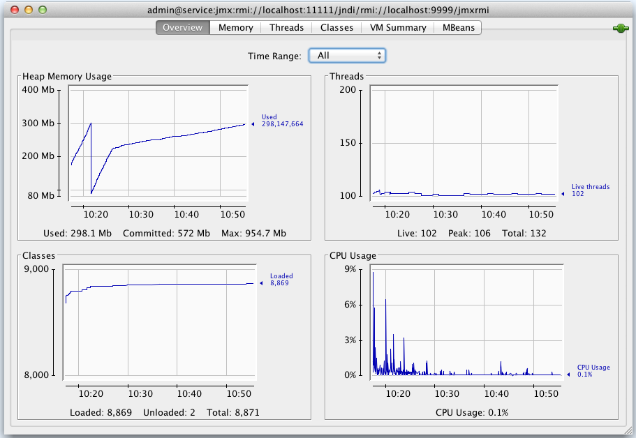 

    -   **Memory**: See the Oracle documentation on [using JConsole](http://docs.oracle.com/javase/7/docs/technotes/guides/management/jconsole.html)
    for more information on these tabs.

        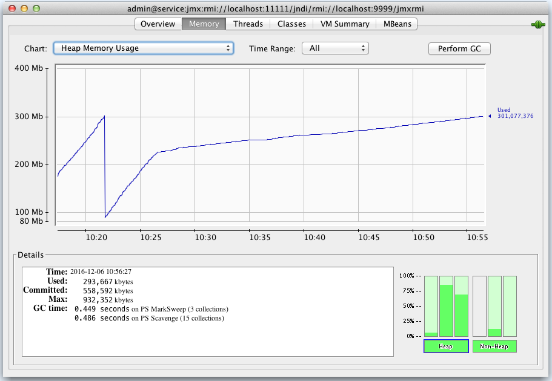 

    -   **Threads**: See the Oracle documentation on [using JConsole](http://docs.oracle.com/javase/7/docs/technotes/guides/management/jconsole.html)
    for more information on these tabs.

        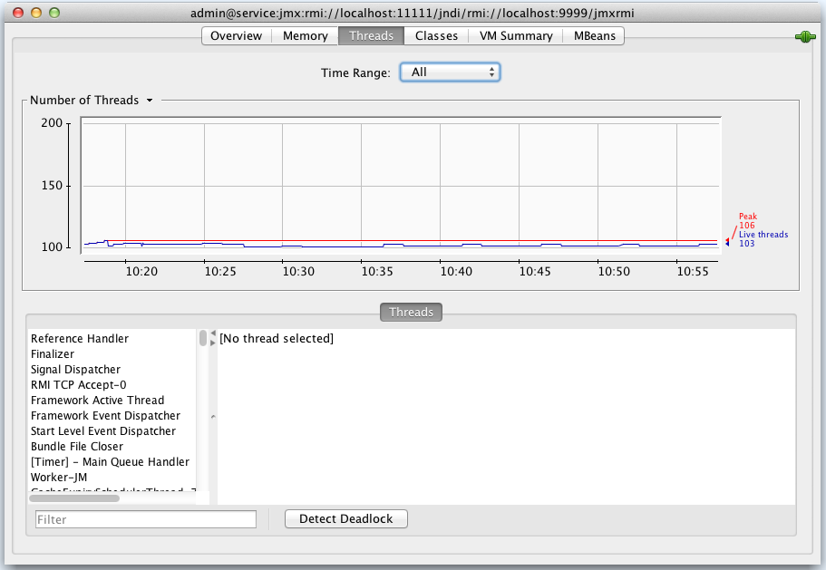 

    -   **Classes**: See the Oracle documentation on [using JConsole](http://docs.oracle.com/javase/7/docs/technotes/guides/management/jconsole.html)
    for more information on these tabs.

        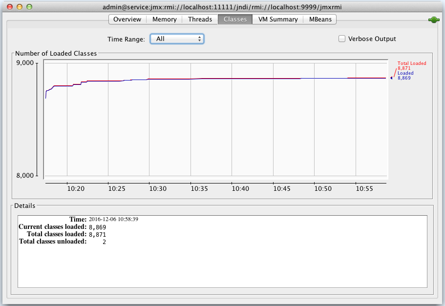 

    -   **VM**: See the Oracle documentation on [using JConsole](http://docs.oracle.com/javase/7/docs/technotes/guides/management/jconsole.html)
    for more information on these tabs.

        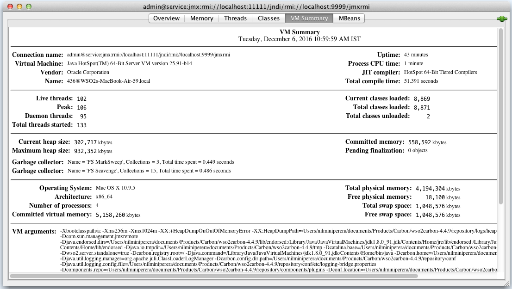 

    -   **MBeans**: See the Oracle documentation on [using JConsole](http://docs.oracle.com/javase/7/docs/technotes/guides/management/jconsole.html)
    for more information on these tabs.

        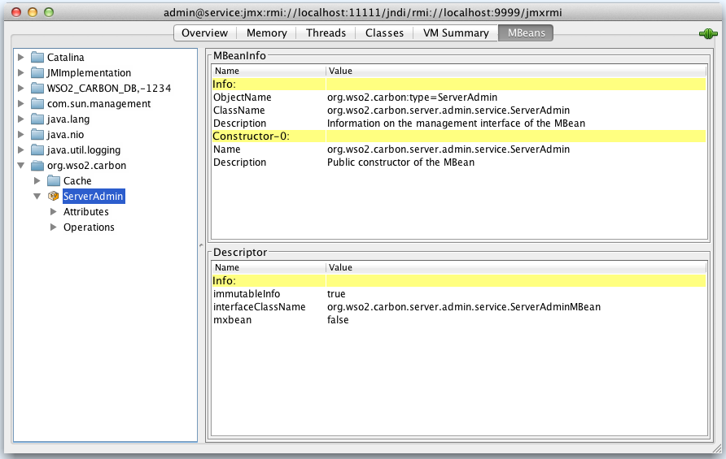 

#### Using the ServerAdmin MBean

When you go to the **MBeans** tab in the JConsole, the **ServerAdmin**
MBean will be listed under the **&org.wso2.carbon** domain as shown
below.  

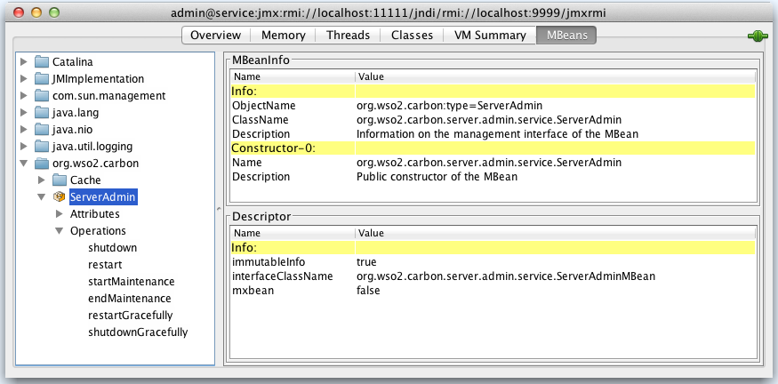 

The **ServerAdmin** MBean is used for administering the WSO2 Identity Server
instance. There are several server attributes such as **ServerStatus**,
**ServerData** and **ServerVersion**. 

The **ServerStatus** attribute can take
any of the following values: 

<ul>
    <li><code>RUNNING</code></li>
    <li><code>SHUTTING_DOWN</code></li>
    <li><code>RESTARTING</code></li>
    <li><code>IN_MAINTENANCE</code></li>
</ul>

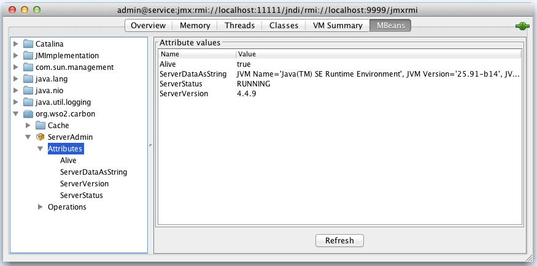 

The **ServerAdmin** MBean has the following operations:

| Operation              | Description                                                                                                 |
|------------------------|-------------------------------------------------------------------------------------------------------------|
| **shutdown**           | Forcefully shut down the server.                                                                            |
| **restart**            | Forcefully restart the server.                                                                              |
| **restartGracefully**  | Wait till all current requests are served and then restart.                                                 |
| **shutdownGracefully** | Wait till all current requests are served and then shutdown.                                                |
| **startMaintenance**   | Switch the server to maintenance mode. No new requests will be accepted while the server is in maintenance. |
| **endMaintenance**     | Switch the server to normal mode if it was switched to maintenance mode earlier.                            |

  
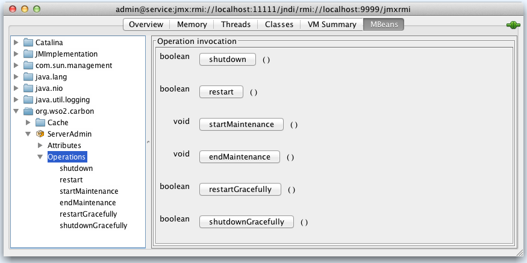 

#### Using the ServiceAdmin MBean

This MBean is used for administering services deployed in WSO2 IS.
Its attributes are as follows:

| Attribute                    | Description                                                          |
|------------------------------|----------------------------------------------------------------------|
| **NumberOfActiveServices**   | The number of services which can currently serve requests.           |
| **NumberOfInactiveServices** | The number of services which have been disabled by an administrator. |
| **NumberOfFaultyServices**   | The number of services which are faulty.                             |

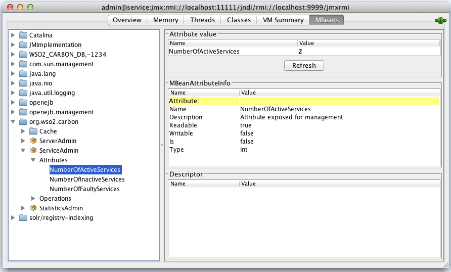 

The operations available in the ServiceAdmin MBean:

| Operation                                          | Description                                                                                      |
|----------------------------------------------------|--------------------------------------------------------------------------------------------------|
| **startService** [p1:string] | The p1 parameter is the service name. You can activate a service using this operation.           |
| **stopService** [p1:string] | The p1 parameter is the service name. You can deactivate/disable a service using this operation. |

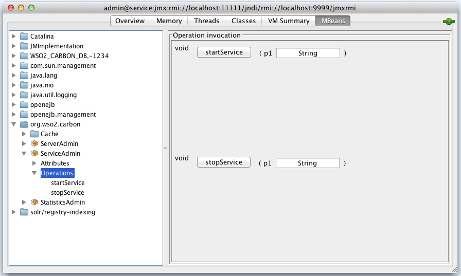 

#### Using the StatisticsAdmin MBean

This MBean is used for monitoring system and server statistics. Its
attributes are as follows:

| Attributes                | Description                                                                                                                                      |
|---------------------------|--------------------------------------------------------------------------------------------------------------------------------------------------|
| **AvgSystemResponseTime** | The average response time for all the services deployed in the system. The beginning of the measurement is the time at which the server started. |
| **MaxSystemResponseTime** | The maximum response time for all the services deployed in the system. The beginning of the measurement is the time at which the server started. |
| **MinSystemResponseTime** | The minimum time for all the services deployed in the system. The beginning of the measurement is the time at which the server started.          |
| **SystemFaultCount**      | The total number of faults that occurred in the system since the server was started.                                                             |
| **SystemRequestCount**    | The total number of requests that has been served by the system since the server was started.                                                    |
| **SystemResponseCount**   | The total number of response that has been sent by the system since the server was started.                                                      |

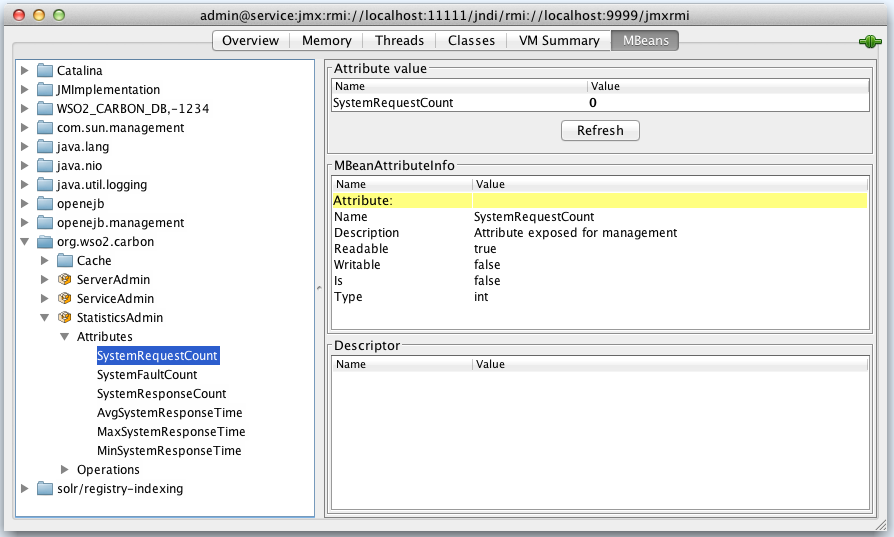 

Operations available in the **Statistics** MBean:

| Operation                                                                                         | Description                                                                                                                                                                                                         |
|---------------------------------------------------------------------------------------------------|---------------------------------------------------------------------------------------------------------------------------------------------------------------------------------------------------------------------|
| **getServiceRequestCount** (p1:string)                                      | The p1 parameter is the service name. You can get the total number of requests received by this service since the time it was deployed, using this operation.                                                       |
| **getServiceResponseCount** (p1:string)                                | The p1 parameter is the service name. You can get the total number of responses sent by this service since the time it was deployed, using this operation.                                                          |
| **getServiceFaultCount** (p1:string)                                      | The p1 parameter is the service name. You can get the total number of fault responses sent by this service since the time it was deployed, using this operation.                                                    |
| **getMaxServiceResponseTime** (p1:string)                                   | The p1 parameter is the service name. You can get the maximum response time of this service since deployment.                                                                                                       |
| **getMinServiceResponseTime** (p1:string)                                   | The p1 parameter is the service name. You can get the minimum response time of this service since deployment.                                                                                                       |
| **getAvgServiceResponseTime** (p1:string)                                   | The p1 parameter is the service name. You can get the average response time of this service since deployment.                                                                                                       |
| **getOperationRequestCount** (p1:string, p2:string)    | The p1 parameter is the service name. The p2 parameter is the operation name. You can get the total number of requests received by this operation since the time its service was deployed, using this operation.    |
| **getOperationResponseCount** (p1:string, p2:string)| The p1 parameter is the service name. The p2 parameter is the operation name. You can get the total number of responses sent by this operation since the time its service was deployed, using this operation.       |
| **getOperationFaultCount** (p1:string, p2:string)    | The p1 parameter is the service name. The p2 parameter is the operation name. You can get the total number of fault responses sent by this operation since the time its service was deployed, using this operation. |
| **getMaxOperationResponseTime** (p1:string, p2:string) | The p1 parameter is the service name. The p2 parameter is the operation name. You can get the maximum response time of this operation since deployment.                                                             |
| **getMinOperationResponseTime** (p1:string, p2:string) | The p1 parameter is the service name. The p2 parameter is the operation name. You can get the minimum response time of this operation since deployment.                                                             |
| **getAvgOperationResponseTime** (p1:string, p2:string) | The p1 parameter is the service name. The p2 parameter is the operation name. You can get the average response time of this operation since deployment.                                                             |

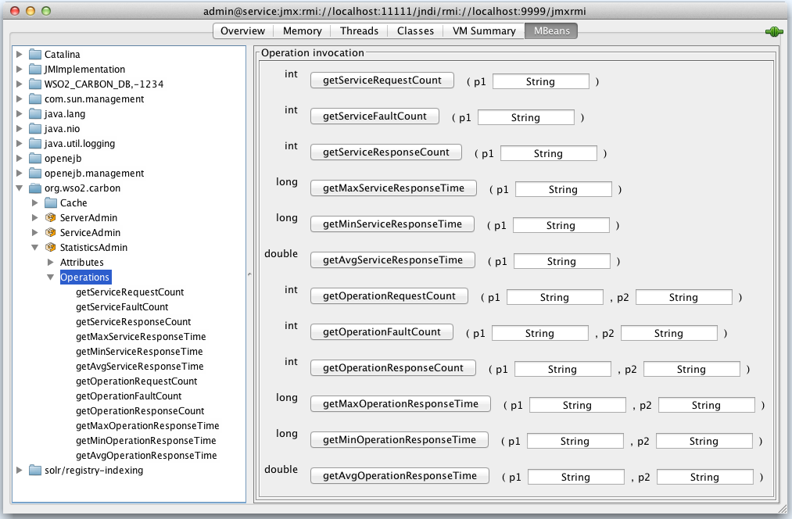 

#### Using the DataSource MBean

If you have [JMX enabled for a datasource connected to the
WSO2 IS instance](#enabling-jmx-for-a-datasource), you can
monitor the performance of the datasource using this MBean. The
**DataSource** MBean will be listed as shown below.  
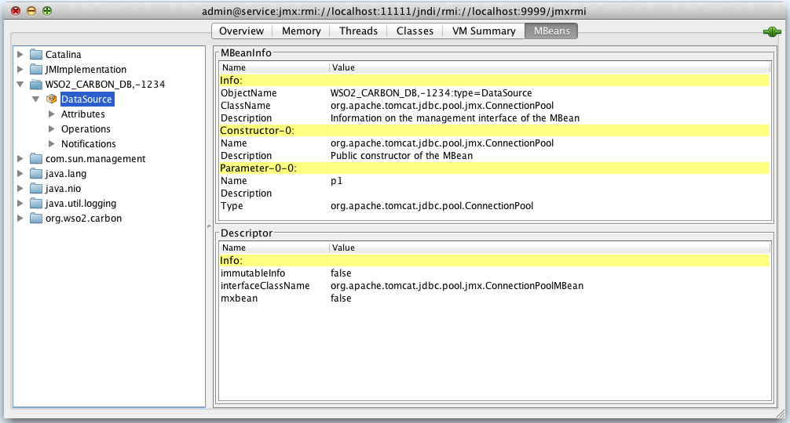 

**Example:** If you have JMX enabled for the default Carbon datasources
in the ` deployement.toml ` file, the [JDBC connection pool
parameters](http://tomcat.apache.org/tomcat-9.0-doc/jdbc-pool.html) that
are configured for the Carbon datasource will be listed as attributes as
shown below. See the
[performance tuning guide](../../setup/performance-tuning-recommendations/#jdbc-pool-configuration)
for instructions on how these parameters are configured for a
datasource.  
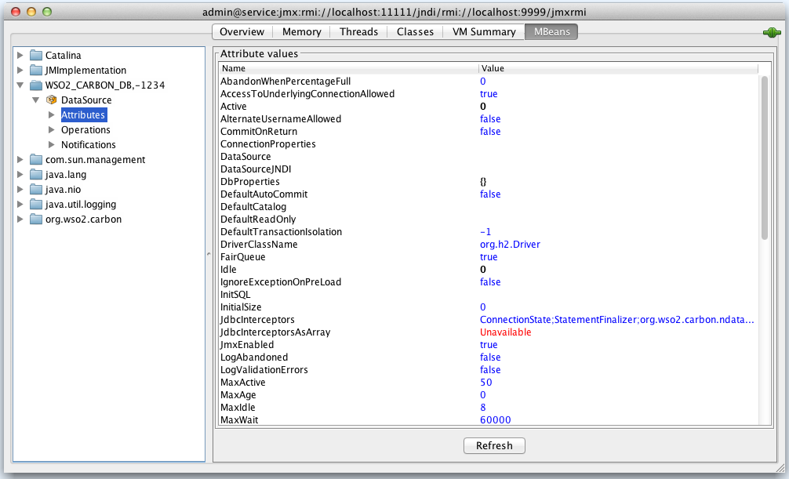

### Monitoring WSO2 IS with Jolokia

[Jolokia](https://jolokia.org) is a JMX-HTTP bridge, which is an
alternative to JSR-160 connectors. It is an agent-based approach that
supports many platforms. In addition to basic JMX operations, it
enhances JMX monitoring with unique features like bulk requests and
fine-grained security policies.

Follow the steps below to use Jolokia to monitor WSO2 IS.

1.  Download [Jolokia OSGi Agent](https://jolokia.org/download.html).
    (These instructions are tested with the Jolokia OSGI Agent version
    1.3.6 by downloading the `          jolokia-osgi-1.3.6.jar         `
    file.)
2.  Add it to the
    `           <IS-HOME>/repository/components/dropins/          `
    directory.

3.  Start WSO2 Identity Server.

Once the server starts, you can read MBeans using Jolokia APIs.
Following are a few examples.

-   List all available MBeans: `http://localhost:9763/jolokia/list`
    (Change the appropriate hostname and port accordingly)
-   Reading Heap Memory:
    `http://localhost:9763/jolokia/read/java.lang:type=Memory/HeapMemoryUsage`

For more information on the JMX MBeans that are available in WSO2
products, see [Monitoring WSO2 IS with
JConsole](#monitoring-wso2-identity-server-with-jconsole).
