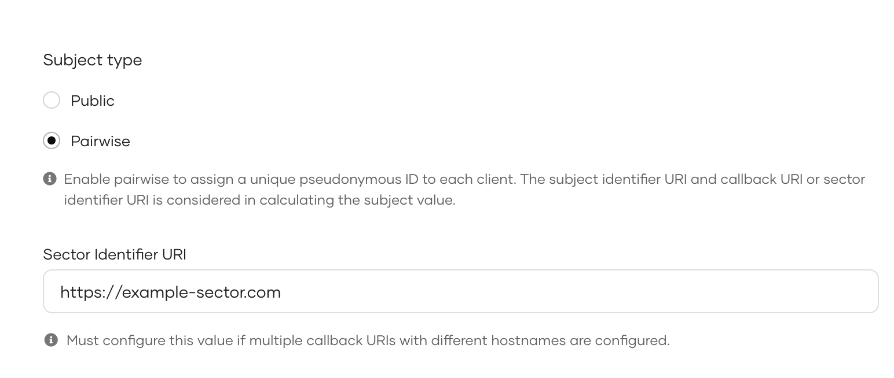



{% set configure_subject_identifier = "
## Configure the subject identifier

WSO2 Identity Server uses a subject attribute to uniquely identify users logging into OIDC applications. This is set to be the **user ID** of the user which can be found in the user's profile in **User Management** > **Users**.

However, having a single subject identifier for multiple applications may enable external entities to track the activity of a user across applications based on a single attribute.

You can opt for a pairwise subject identifier to mitigate this issue. With a pairwise subject identifier, WSO2 Identity Server generates a unique pseudonymous ID for each user-application pair protecting the user's identity when accessing multiple applications.

Follow the steps below to configure the subject identifier type:

1. On the WSO2 Identity Server Console, go to **Applications**.

2. Select the application and go to its **User Attributes** tab.

3. Under **Subject type**, select **Pairwise**.

4. Enter a **Sector Identifier URI**.

    !!! info
        The sector identifier URI is used to group clients belonging to the same security domain so that the same pairwise identifier is used for a given user accessing these clients.

    

4. Click **Update** to save the changes.

" %}
